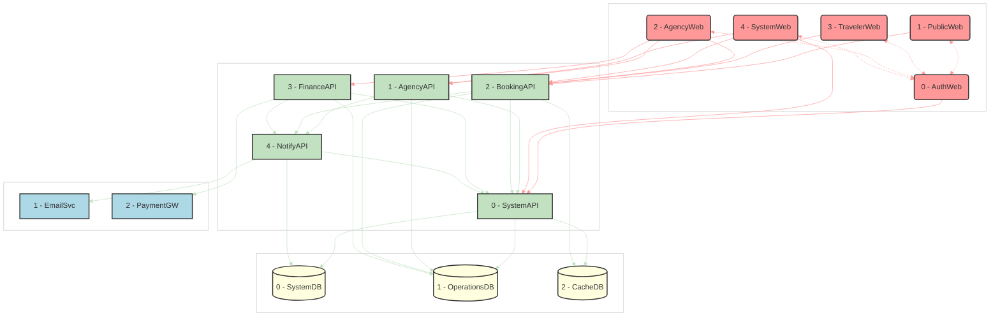

# AstroBookings: System Architecture

> Timestamp: 2024-08-19 20:30:00 UTC

## System Components

### 🌐 Web Applications

0. `🌐 AuthWeb`: Authentication and user management interface
1. `🌐 PublicWeb`: Showcase of available launches and public information
2. `🌐 AgencyWeb`: Management interface for space agencies
3. `🌐 TravelerWeb`: Booking and management interface for travelers
4. `🌐 SystemWeb`: Administrative interface for AstroBookings employees

### 🧑‍💼 API Services

0. `🧑‍💼 SystemAPI`: Handles authentication, authorization, and system-wide operations
1. `🧑‍💼 AgencyAPI`: Manages agency profiles and launches
2. `🧑‍💼 BookingAPI`: Handles seat reservations and cancellations
3. `🧑‍💼 FinanceAPI`: Manages invoicing and payments
4. `🧑‍💼 NotifyAPI`: Handles email notifications

### 📇 Databases

0. `📇 SystemDB`: Stores user profiles, authentication data, and system logs
1. `📇 OperationsDB`: Stores structured data for bookings, launches, and financial transactions
2. `📇 CacheDB`: Provides quick data access for frequently requested information

### 👽 External Services

1. `👽 EmailSvc`: For sending notifications
2. `👽 PaymentGW`: For processing payments

## System Architecture Diagram

---

## Detailed Component Descriptions

### 0. 🌐 AuthWeb

Centralized authentication and user management interface for all user types in the AstroBookings platform. It provides secure login, registration, and profile management functionalities.

Built with **Angular** for a secure and user-friendly authentication experience.

#### ⬇️ Consumes:

- `🧑‍💼 SystemAPI`: For user authentication, registration, and profile management

#### ⬆️ Provides for:

- `🌐 PublicWeb`, `🌐 TravelerWeb`, `🌐 AgencyWeb`, `🌐 SystemWeb`: Authentication services

### 1. 🌐 PublicWeb

Public-facing website showcasing available space launches and company information. It provides an intuitive interface for visitors to explore upcoming launches, learn about space travel opportunities, and access general information about AstroBookings.

Built with **Angular** for a responsive and dynamic user experience.

#### ⬇️ Consumes:

- `🌐 AuthWeb`: For user authentication
- `🧑‍💼 BookingAPI`: To display available launches and their details

#### ⬆️ Provides for:

- `👤 Visitor`: Browse launches, view company information, explore space travel options
- `🧑 Traveler`: Register for an account, log in to access personalized features

### 2. 🌐 AgencyWeb

Comprehensive management interface for space agencies to oversee their operations within the AstroBookings platform. Agencies can create and update their profiles, manage their fleet of rockets, schedule and modify launches, and access detailed booking and financial reports.

Developed using **Angular** for a robust and user-friendly experience.

#### ⬇️ Consumes:

- `🌐 AuthWeb`: For agency authentication
- `🧑‍💼 AgencyAPI`: To manage agency profile and launches
- `🧑‍💼 BookingAPI`: To view bookings for their launches
- `🧑‍💼 FinanceAPI`: To access financial reports and invoices

#### ⬆️ Provides for:

- `👨‍💼 Agency`: Comprehensive tools to manage agency profile, rockets, schedule launches, view occupancy, manage launch statuses, and access booking reports

### 3. 🌐 TravelerWeb

Feature-rich interface designed for registered travelers to explore, book, and manage their space travel experiences. Travelers can browse available launches, make reservations, manage their bookings, and access detailed information about their upcoming trips.

Built with **Angular** to ensure a smooth and engaging user experience.

#### ⬇️ Consumes:

- `🌐 AuthWeb`: For traveler authentication
- `🧑‍💼 BookingAPI`: To make and manage bookings

#### ⬆️ Provides for:

- `🧑 Traveler`: Book seats on launches, manage reservations, view launch status updates, cancel bookings and request refunds
- `🧑 VIP Traveler`: Access exclusive notifications about new launches, book additional seats

### 4. 🌐 SystemWeb

Administrative interface for AstroBookings employees to manage and monitor all aspects of the platform. It provides comprehensive tools for user management, agency oversight, booking administration, financial operations, and system health monitoring.

Developed with **Angular** to handle complex operations with ease and efficiency.

#### ⬇️ Consumes:

- `🌐 AuthWeb`: For employee authentication
- `🧑‍💼 SystemAPI`: For system-wide operations and monitoring
- `🧑‍💼 AgencyAPI`: To manage agencies
- `🧑‍💼 BookingAPI`: To oversee all bookings

#### ⬆️ Provides for:

- `👨‍💼 Employee`: Comprehensive tools to manage all aspects of the AstroBookings platform, including user administration, agency oversight, booking management, financial control, and system configuration

---

### 0. 🧑‍💼 SystemAPI

Central API for authentication, authorization, and system-wide operations. It manages user sessions, handles access control, and provides interfaces for system monitoring and management.

Developed using **NestJS** with **TypeScript** for robust type checking, maintainability, and scalable architecture.

#### ⬇️ Consumes:

- `📇 SystemDB`: For user authentication and system logs
- `📇 OperationsDB`: For system-wide operational data
- `📇 CacheDB`: For quick access to frequently used data

#### ⬆️ Provides for:

- All Web Applications: Authentication and authorization services
- Other APIs: Central authentication and system management services

### 1. 🧑‍💼 AgencyAPI

Manages all agency-related operations including profile management, rocket fleet administration, and launch scheduling. This API handles the creation, updating, and retrieval of agency data, as well as the management of their launches and associated details.

Built with **NestJS** and **TypeScript** to ensure scalability, maintainability, and a modular architecture.

#### ⬇️ Consumes:

- `📇 OperationsDB`: To store and retrieve agency and launch data

#### ⬆️ Provides for:

- `🌐 AgencyWeb`: Agency management functionalities
- `🌐 SystemWeb`: Agency oversight tools
- `🧑‍💼 SystemAPI`: Agency-related data for system-wide operations
- `🧑‍💼 NotifyAPI`: Trigger notifications for agency-related events

### 2. 🧑‍💼 BookingAPI

Handles all aspects of the booking process, including seat reservations, cancellations, and modifications. This API manages the availability of seats for launches, processes booking requests, and handles the logistics of seat assignments and launch capacities.

Implemented using **NestJS** with **TypeScript** for high-performance booking operations and a well-structured codebase.

#### ⬇️ Consumes:

- `📇 OperationsDB`: To manage booking data and launch occupancy
- `📇 CacheDB`: For quick access to frequently requested booking information

#### ⬆️ Provides for:

- `🌐 PublicWeb`: Display of available launches
- `🌐 TravelerWeb`: Booking management for travelers
- `🌐 AgencyWeb`: View and manage bookings for agency launches
- `🌐 SystemWeb`: Oversee all bookings
- `🧑‍💼 SystemAPI`: Booking-related data for system-wide operations
- `🧑‍💼 NotifyAPI`: Trigger notifications for booking-related events

### 3. 🧑‍💼 FinanceAPI

Manages all financial aspects of the AstroBookings platform, including invoice generation, payment processing, and financial reporting. This API handles the calculation of fees, generation of invoices for agencies, and tracking of payment statuses.

Developed using **NestJS** and **TypeScript** with robust security measures for handling financial data and a modular, easily maintainable structure.

#### ⬇️ Consumes:

- `📇 OperationsDB`: To store and retrieve financial transaction data
- `👽 PaymentGW`: To process payments

#### ⬆️ Provides for:

- `🌐 AgencyWeb`: Access to financial reports and invoices
- `🧑‍💼 SystemAPI`: Financial data for system-wide operations
- `🧑‍💼 NotifyAPI`: Trigger notifications for finance-related events

### 4. 🧑‍💼 NotifyAPI

Manages the notification system for the entire platform, handling email notifications for various events such as booking confirmations, launch updates, and system alerts. This API coordinates the creation, queuing, and sending of notifications to users.

Built with **NestJS** and **TypeScript** for efficient message handling and delivery, leveraging NestJS's powerful module system for organized code structure.

#### ⬇️ Consumes:

- `📇 SystemDB`: To manage notification queues and user communication preferences
- `👽 EmailSvc`: To send out email notifications

#### ⬆️ Provides for:

- `🧑‍💼 SystemAPI`: Notification status and management
- Other APIs: Notification sending capabilities

---

### 0. 📇 SystemDB

Central database for system-wide data including user profiles, authentication information, system logs, and notification queues. It serves as the backbone for system management and cross-functional operations.

Built with **MongoDB** to handle diverse, document-based data structures with flexibility and scalability.

#### ⬇️ Consumes data from:

- `🧑‍💼 SystemAPI`: User registration, profile updates, and system logs
- `🧑‍💼 NotifyAPI`: Notification queue entries

#### ⬆️ Provides data for:

- `🧑‍💼 SystemAPI`: User authentication, profile retrieval, and system log access
- `🧑‍💼 NotifyAPI`: Notification queue management

### 1. 📇 OperationsDB

Primary relational database that stores all core operational data for the AstroBookings platform. This includes detailed information about launches, bookings, agencies, rockets, and financial transactions. It serves as the source of truth for all business operations.

Implemented using **PostgreSQL** for its robust handling of complex relational data and support for advanced querying.

#### ⬇️ Consumes data from:

- `🧑‍💼 AgencyAPI`: Agency profiles, rocket information, and launch schedules
- `🧑‍💼 BookingAPI`: Booking details and seat allocations
- `🧑‍💼 FinanceAPI`: Financial transactions and invoice data

#### ⬆️ Provides data for:

- `🧑‍💼 SystemAPI`: System-wide operational data access
- `🧑‍💼 AgencyAPI`: Agency and launch information retrieval and updates
- `🧑‍💼 BookingAPI`: Booking operations and seat availability management
- `🧑‍💼 FinanceAPI`: Financial data for reporting and invoicing

### 2. 📇 CacheDB

High-performance, in-memory database used to store frequently accessed data for quick retrieval. It improves the responsiveness of the public website and traveler portal by reducing the load on the primary databases.

Can be implemented using either **Redis** or **MongoDB**, depending on specific performance needs and data structures required.

#### ⬇️ Consumes data from:

- `🧑‍💼 SystemAPI`: Frequently accessed system-wide data
- `🧑‍💼 BookingAPI`: Current seat availability and pricing information

#### ⬆️ Provides data for:

- `🧑‍💼 SystemAPI`:
