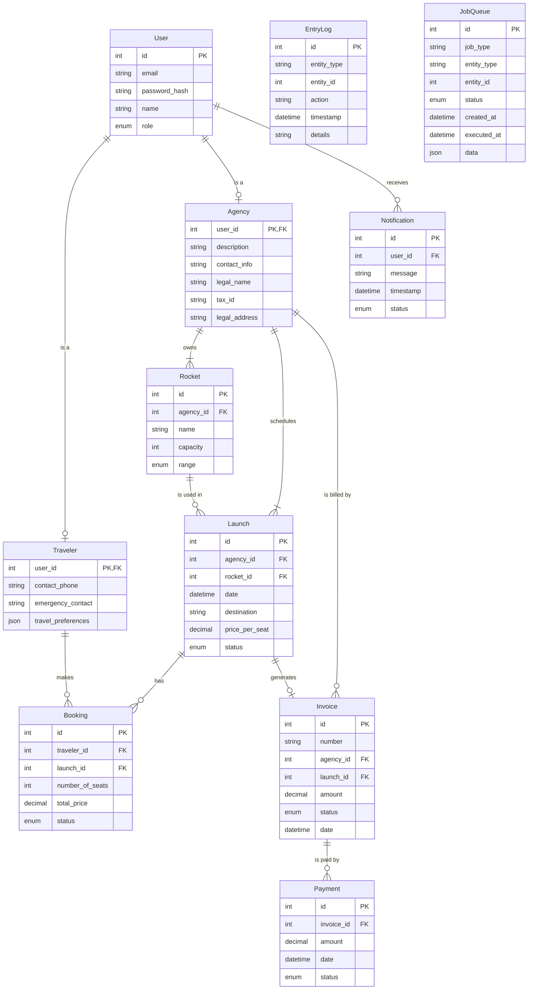

# AstroBookings: Entity-Relationship Diagram

> Timestamp: 2024-08-19 21:30:00 UTC

## Entities

1. `User`: Base entity for all system users. Contains common information such as access credentials and contact data.

2. `Traveler`: Specialization of User. Represents clients who make bookings for space travels.

3. `Agency`: Specialization of User. Represents space agencies that offer launches.

4. `Rocket`: Represents spacecraft owned by agencies. Includes details such as capacity and range.

5. `Launch`: Represents a scheduled space trip. Includes information such as date, destination, and price per seat.

6. `Booking`: Represents the reservation of seats on a specific launch made by a traveler.

7. `Invoice`: Represents charges generated for agencies for completed launches. Can be associated with one or more payments.

8. `Payment`: Represents payments made by agencies to settle issued invoices.

9. `Notification`: Represents messages sent to system users about various events.

10. `EntryLog`: Represents system activity logs, used for monitoring and auditing.

11. `JobQueue`: Represents pending tasks for data synchronization between different parts of the system.

## Relationships

1. User _(1 to 0 or 1)_ Traveler
   - `User` _can be a_ `Traveler`
   - `Traveler` _is a_ `User`

2. User _(1 to 0 or 1)_ Agency
   - `User` _can be an_ `Agency`
   - `Agency` _is a_ `User`

3. User _(1 to 0 or many)_ Notification
   - `User` _receives_ `Notification`
   - `Notification` _is sent to_ `User`

4. Traveler _(1 to 0 or many)_ Booking
   - `Traveler` _makes_ `Booking`
   - `Booking` _is made by_ `Traveler`

5. Agency _(1 to 0 or many)_ Rocket
   - `Agency` _owns_ `Rocket`
   - `Rocket` _is owned by_ `Agency`

6. Agency _(1 to 0 or many)_ Launch
   - `Agency` _schedules_ `Launch`
   - `Launch` _is scheduled by_ `Agency`

7. Agency _(1 to 0 or many)_ Invoice
   - `Agency` _is billed by_ `Invoice`
   - `Invoice` _bills_ `Agency`

8. Rocket _(1 to 0 or many)_ Launch
   - `Rocket` _is used in_ `Launch`
   - `Launch` _uses_ `Rocket`

9. Launch _(1 to 0 or many)_ Booking
   - `Launch` _has_ `Booking`
   - `Booking` _is for_ `Launch`

10. Launch _(1 to 0 or 1)_ Invoice
    - `Launch` _generates_ `Invoice`
    - `Invoice` _is generated by_ `Launch`

11. Invoice _(1 to 0 or many)_ Payment
    - `Invoice` _is paid by_ `Payment`
    - `Payment` _pays_ `Invoice`

## Entity-Relationship Diagram

