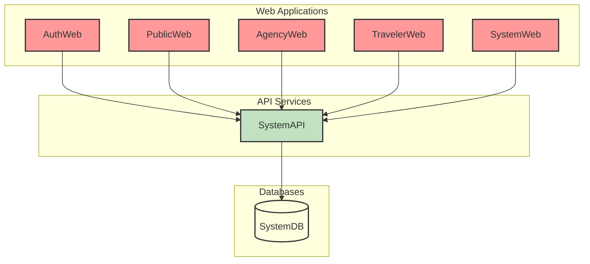
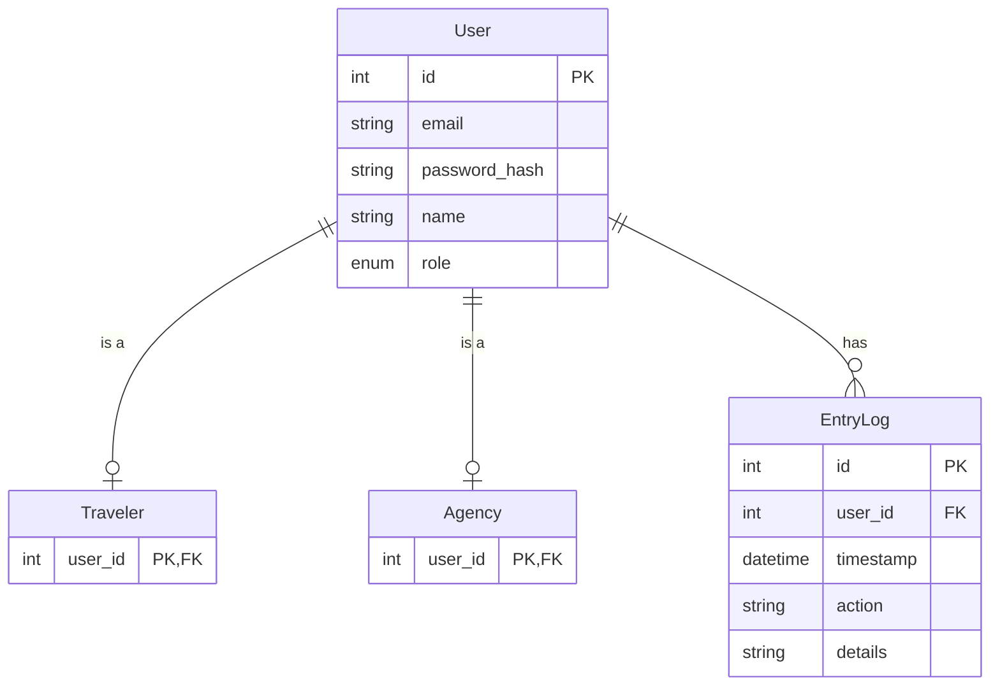

# AstroBookings: Authentication Domain

> Timestamp: 2024-08-20 21:30:00 UTC

The Authentication domain in AstroBookings ensures secure access management for travelers, agencies, and employees in a high-stakes space travel platform. It addresses the challenges of unauthorized access prevention and secure session management across diverse user roles.

Our solution implements JSON Web Tokens (JWT) for stateless authentication, providing secure registration, login processes, and role-based access control. This approach enhances system scalability and security while offering a seamless user experience.

## User Stories

### 0.1 As a visitor, I want to register an account, so that I can access the system.

- Provide a registration form with fields for email, password, name, and role (agency, traveler, or employee).
- Validate email uniqueness in the system.
- Encrypt the password before storing it.
- Generate a confirmation email for the new account.
- Create a new user account with appropriate permissions based on the selected role.

### 0.2 As a user, I want to log in to the system, so that I can access my account.

- Provide a login form with fields for email and password.
- Validate the provided credentials against stored user information.
- Implement rate limiting to prevent brute force attacks.
- Create a session for the authenticated user.
- Redirect to the appropriate dashboard based on the user's role.

### 0.3 As a user, I want to log out of the system to ensure the security of my account.

- Provide a logout option in the user interface.
- Invalidate the current user session.
- Clear any client-side stored authentication data.
- Redirect to the login page or public homepage after logout.

### 0.4 As the system, I need to generate a JWT for a validated user to maintain their session securely.

- Generate a JSON Web Token (JWT) upon successful user authentication.
- Include relevant user information in the JWT payload (e.g., user ID, role, permissions).
- Set an appropriate expiration time for the JWT.
- Sign the JWT with a secure secret key.

### 0.5 As the system, I need to validate a JWT and identify the user to ensure secure access to protected resources.

- Implement middleware to check JWT validity for protected routes.
- Verify the JWT signature using the secret key.
- Check the JWT expiration time.
- Extract user information from the JWT payload.
- Attach the user information to the request for use in protected routes.

## Affected Components

### 🌐 Web Applications

- `🌐 AuthWeb`: Primary interface for user authentication and registration.
- `🌐 PublicWeb`: Integrates authentication for accessing personalized features.
- `🌐 AgencyWeb`: Utilizes authentication for agency login and session management.
- `🌐 TravelerWeb`: Implements authentication for traveler login and session management.
- `🌐 SystemWeb`: Uses authentication for employee login and access control.

### 🧑‍💼 API Services

- `🧑‍💼 SystemAPI`: Central service for handling authentication and authorization logic.

### 📇 Databases

- `📇 SystemDB`: Stores user profiles, authentication data, and system logs.

### Component Interfaces

This diagram illustrates the interfaces between the components involved in the Authentication domain:

1. All web applications (AuthWeb, PublicWeb, AgencyWeb, TravelerWeb, and SystemWeb) communicate with the SystemAPI for authentication and authorization purposes.
2. The SystemAPI is the central service handling all authentication logic and requests.
3. The SystemAPI interacts with the SystemDB to store and retrieve user data, authentication records, and logs.

## Related Entities

1. `User`:

   - Represents the base entity for all system users.
   - Contains fields such as id, email, password_hash, name, and role.

2. `Traveler`:

   - Specialization of User entity for clients booking space travels.
   - Inherits from User and may contain additional fields specific to travelers.

3. `Agency`:

   - Specialization of User entity for space agencies offering launches.
   - Inherits from User and may contain additional fields specific to agencies.

4. `EntryLog`:
   - Used to record authentication-related activities for auditing purposes.
   - May include fields like timestamp, user_id, action (e.g., login, logout, registration).

### Entity-Relationship Diagram

This diagram ERD shows the following relationships:

1. `User` is the base entity that can be specialized into `Traveler` or `Agency` (relationship "is a").
2. `User` has a one-to-many relationship with `EntryLog`, allowing multiple log entries for each user.
3. `Traveler` and `Agency` are specializations of `User`, inheriting its attributes and potentially adding specific attributes (not shown in this simplified diagram).
4. `EntryLog` has a foreign key `user_id` that relates to the primary key of `User`.
