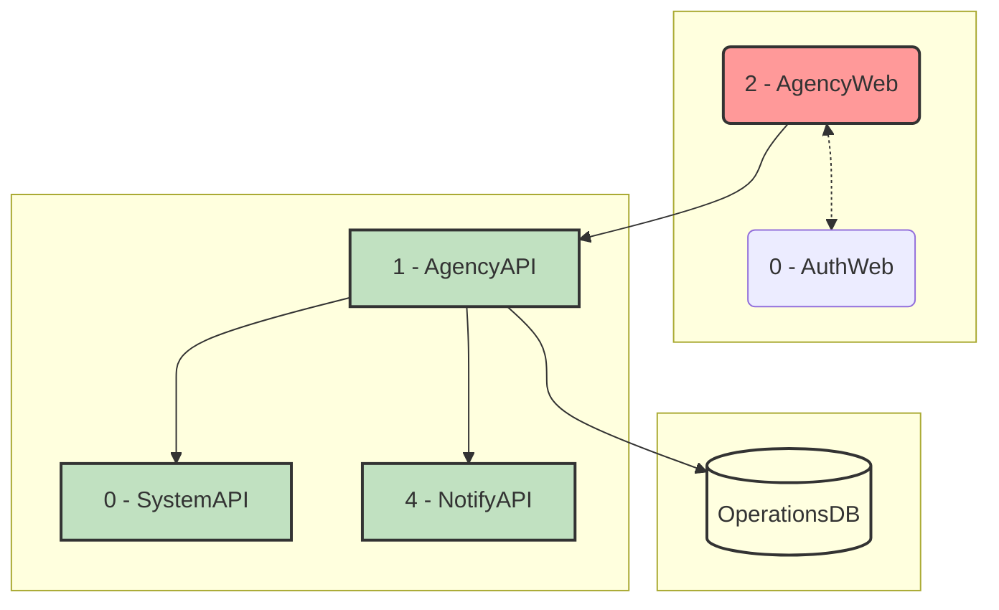
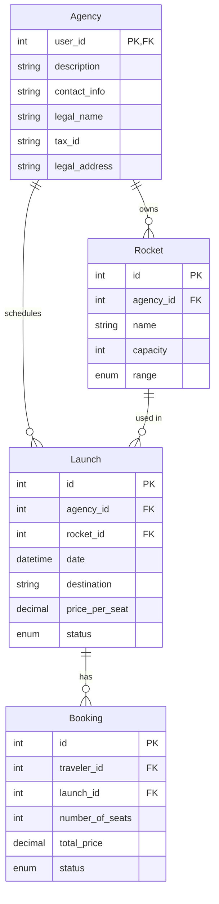

# AstroBookings: Agency Management Domain

> Timestamp: 2024-08-20 22:30:00 UTC

The Agency Management domain in AstroBookings focuses on enabling space agencies to effectively manage their profiles, rocket fleets, and launch schedules. It addresses the complexities of coordinating space travel offerings in a commercial platform.

Our solution provides a comprehensive set of tools for agencies to maintain their information, manage their spacecraft inventory, schedule launches, and monitor bookings. This streamlined approach enhances operational efficiency and facilitates the seamless integration of agency services into the AstroBookings platform.

## User Stories

### 1.1 As an agency, I want to create and manage my profile so that I can offer my services.

- Provide a form for agencies to enter and update their profile information (name, description, contact details).
- Allow upload and management of agency logo and promotional images.
- Implement validation for required fields and data formats.
- Store agency profile data securely in the database.

### 1.2 As an agency, I want to add and manage my rockets so that I can use them for launches.

- Create an interface for adding new rockets with details (name, model, capacity, range).
- Allow editing and deactivation of existing rocket information.
- Implement validation for rocket specifications.
- Associate rockets with the agency's profile.

### 1.3 As an agency, I want to schedule new launches so that travelers can book seats.

- Provide a form to create new launch entries (date, time, destination, associated rocket).
- Implement date and time validation to ensure launches are scheduled in the future.
- Allow setting of seat pricing and available capacity.
- Associate launches with specific rockets and the agency.

### 1.4 As an agency, I want to view the occupancy of my scheduled launches to decide if they are viable.

- Create a dashboard showing all scheduled launches with their current booking status.
- Display occupancy rates and remaining available seats for each launch.
- Implement filtering and sorting options for better data analysis.
- Provide a threshold indicator for launch viability based on occupancy.

### 1.5 As an agency, I want to delay, abort, fail or mark as successful my scheduled launches.

- Develop functionality to update launch statuses (delay, abort, fail, success).
- Implement appropriate checks before allowing status changes (e.g., can't mark as successful before launch date).
- Ensure all status changes are logged for auditing purposes.
- Trigger notifications to affected travelers when a launch status changes.

### 1.6 As an agency, I want to view a report of bookings for successful launches so that I can issue invoices.

- Generate detailed reports of bookings for each successful launch.
- Include information such as passenger details, number of seats booked, and total revenue.
- Provide options to filter reports by date range or specific launches.
- Allow export of reports in various formats (PDF, CSV).

## Affected Components

### 🌐 Web Applications

- `🌐 AgencyWeb`: Primary interface for agencies to manage their profiles, rockets, and launches.
- `🌐 AuthWeb`: Called to get back user authorization token.

### 🧑‍💼 API Services

- `🧑‍💼 AgencyAPI`: Handles all agency-related operations and data management.

### 📇 Databases

- `📇 OperationsDB`: Stores agency profiles, rocket information, launch schedules, and booking data.

### Component Interfaces

This diagram illustrates the interfaces between the components involved in the Agency Management domain:

1. The AgencyWeb application primarily interacts with the AgencyAPI for all agency operations.
2. PublicWeb and SystemWeb also connect to AgencyAPI to retrieve agency and launch information.
3. BookingAPI and FinanceAPI interact with AgencyAPI to access necessary agency and launch data.
4. AgencyAPI is the central service that interacts with the OperationsDB to store and retrieve all agency-related data.

## Related Entities

1. `Agency`:

   - Represents a space agency offering launch services.
   - Contains fields such as id, name, description, contact information.

2. `Rocket`:

   - Represents a spacecraft owned by an agency.
   - Contains fields such as id, agency_id, name, model, capacity, range.

3. `Launch`:

   - Represents a scheduled space trip.
   - Contains fields such as id, agency_id, rocket_id, date, destination, price_per_seat, status.

4. `Booking`:
   - Represents a reservation made for a launch.
   - Contains fields such as id, launch_id, traveler_id, number_of_seats, total_price.

### Entity-Relationship Diagram

This ERD shows the following relationships:

1. An `Agency` can own multiple `Rockets`
2. An `Agency` can schedule multiple `Launches`
3. A `Rocket` can be used in multiple `Launches`
4. A `Launch` can have multiple `Bookings`

---

## [🚀 AstroBookings](https://github.com/AstroBookings)
