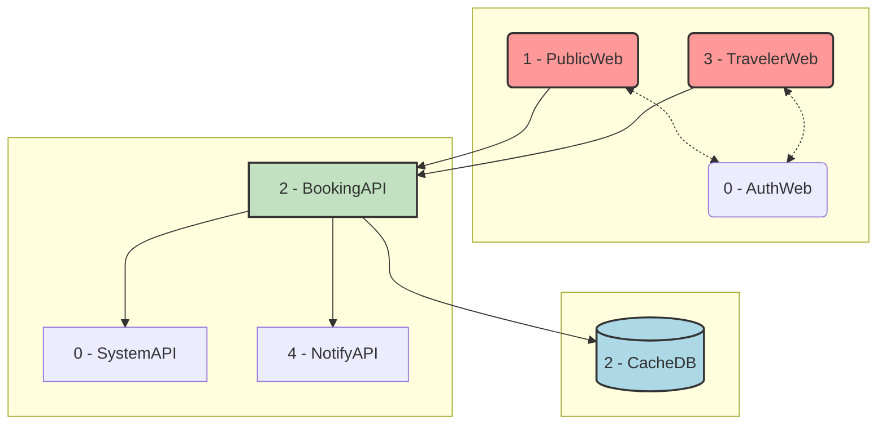
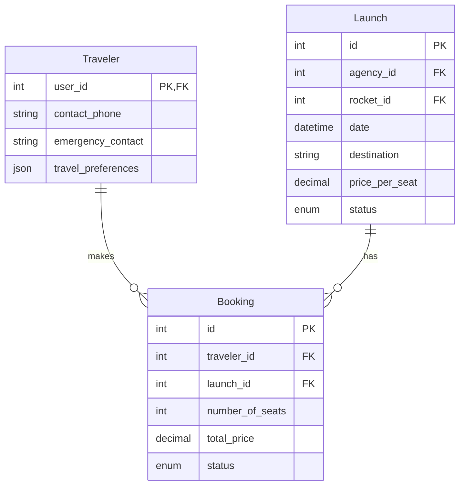

# AstroBookings: Booking Management Domain

> Timestamp: 2024-08-21 15:00:00 UTC

The Booking Management domain in AstroBookings manages traveler bookings, seat reservations, cancellations, and the public-facing website for showcasing launches.

## User Stories

### 2.1 As an anonymous visitor, I want to view available launches so that I can choose a space trip.

- Display a list of upcoming launches with basic information (date, destination, available seats).
- Implement filtering and sorting options for launches.
- Show pricing information for each launch.

### 2.2 As a visitor, I want to register as a traveler with my contact and tax information so that I can book trips and receive proper invoicing from agencies.

- Create a registration form for travelers.
- Collect necessary contact and tax information.
- Implement validation for required fields and data formats (e.g., email, tax ID).
- Store the information securely in the database.

### 2.3 As a registered traveler, I want to book seats on a launch so that I can travel to space.

- Allow selection of number of seats (up to 4 for regular travelers, up to 6 for VIP travelers).
- Implement a booking process with seat selection and payment.
- Update launch occupancy upon successful booking.
- Generate a booking confirmation.

### 2.4 As a traveler, I want to view updates on the status of my booked launch (delays, aborts, etc.) so that I can stay informed about my trip.

- Provide a dashboard for travelers to view their booked launches.
- Display current status of each booked launch.
- Implement a system to show status change history.

### 2.5 As a traveler, I want to cancel my booking and receive a refund if eligible.

- Implement a cancellation process for bookings.
- Calculate refund amount based on cancellation policy and time until launch.
- Update launch occupancy upon cancellation.
- Trigger refund process if eligible.

## Affected Components

### 🌐 Web Applications

- `🌐 PublicWeb`: Showcase of available launches and public information.
- `🌐 TravelerWeb`: Booking and management interface for travelers.

### 🧑‍💼 API Services

- `🧑‍💼 BookingAPI`: Handles seat reservations and cancellations.

### 📇 Databases

- `📇 OperationsDB`: Stores structured data for bookings, launches, and financial transactions.
- `📇 CacheDB`: Provides quick data access for public website and traveler portal.

## Component Interfaces

This diagram illustrates the interfaces between the components involved in the Booking Management domain:

1. PublicWeb and TravelerWeb interact with BookingAPI for all booking-related operations.
2. BookingAPI interacts with OperationsDB for persistent storage of booking data.
3. BookingAPI also uses CacheDB for quick access to frequently requested information.

## Related Entities

1. `Booking`:

   - Represents the reservation of seats on a specific launch made by a traveler.
   - Contains fields such as id, traveler_id, launch_id, number_of_seats, total_price, status.

2. `Launch`:

   - Represents a scheduled space trip.
   - Contains fields such as id, agency_id, rocket_id, date, destination, price_per_seat, available_seats, status.

3. `Traveler`:
   - Represents a registered user who can make bookings.
   - Contains fields such as user_id, contact_phone, emergency_contact, travel_preferences.

### Entity Relationship Diagram

This ERD shows the following relationships:

- A `Traveler` can make multiple `Booking` records.
- A `Launch` can have multiple `Booking` records.

---

## [🚀 AstroBookings](https://github.com/AstroBookings)
