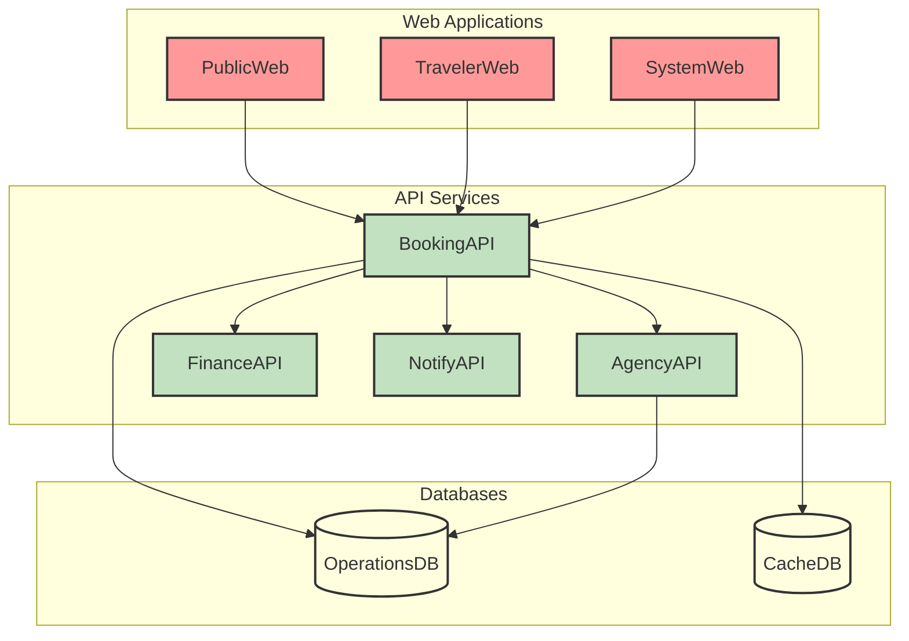
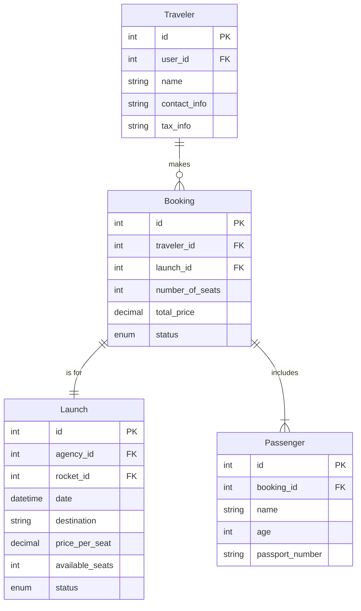

# AstroBookings: Booking Management Domain

> Timestamp: 2024-08-21 09:00:00 UTC

The Booking Management domain in AstroBookings facilitates the process of reserving seats on space launches for travelers. It addresses the challenges of managing seat availability, handling reservations, and processing cancellations in the unique context of commercial space travel.

Our solution provides an intuitive booking system that allows travelers to view available launches, make reservations, and manage their bookings. It ensures real-time seat availability updates and handles the complexities of space travel bookings, including special requirements and VIP traveler privileges.

## User Stories

### 2.1 As an anonymous visitor, I want to view available launches so that I can choose a space trip.

- Display a list of upcoming launches with basic information (date, destination, available seats, price).
- Implement filtering options (by date, destination, price range).
- Show detailed information for each launch upon selection.
- Ensure real-time updates of seat availability.

### 2.2 As a visitor, I want to register as a traveler with my contact and tax information so that I can book trips and receive proper invoicing from agencies.

- Provide a registration form for new travelers.
- Collect necessary personal, contact, and tax information.
- Implement validation for required fields and data formats.
- Create a new traveler account and link it to the user's authentication credentials.

### 2.3 As a registered traveler, I want to book seats on a launch so that I can travel to space.

- Allow selection of number of seats (up to 4 for regular travelers, up to 6 for VIP travelers).
- Provide a booking form to enter passenger details for each seat.
- Calculate and display the total price based on selected seats and any applicable discounts.
- Process the booking and update seat availability in real-time.
- Generate a booking confirmation and send it to the traveler.

### 2.4 As a traveler, I want to view updates on the status of my booked launch so that I can stay informed about my trip.

- Create a dashboard for travelers to view their booked launches.
- Display current status of each booked launch (scheduled, delayed, aborted, etc.).
- Provide real-time notifications for any status changes.
- Allow travelers to view detailed information about their bookings.

### 2.5 As a traveler, I want to cancel my booking and receive a refund if eligible so that I can change my plans if necessary.

- Provide an option to cancel bookings from the traveler's dashboard.
- Implement cancellation policies based on time until launch and agency rules.
- Calculate refund amount based on cancellation policy.
- Process the cancellation and update seat availability.
- Send cancellation and refund confirmation to the traveler.

## Affected Components

### 🌐 Web Applications

- `🌐 PublicWeb`: Displays available launches and allows anonymous browsing.
- `🌐 TravelerWeb`: Provides interface for booking management and traveler dashboard.
- `🌐 SystemWeb`: Allows administrators to oversee and manage bookings.

### 🧑‍💼 API Services

- `🧑‍💼 BookingAPI`: Handles all booking-related operations.
- `🧑‍💼 AgencyAPI`: Provides launch and seat availability information.
- `🧑‍💼 FinanceAPI`: Processes payments and refunds for bookings.
- `🧑‍💼 NotifyAPI`: Sends notifications related to bookings and launch updates.

### 📇 Databases

- `📇 OperationsDB`: Stores booking data, launch information, and traveler details.
- `📇 CacheDB`: Caches frequently accessed data like seat availability for quick retrieval.

## Component Interfaces

This diagram illustrates the interfaces between the components involved in the Booking Management domain:

1. Web applications interact with the BookingAPI for all booking-related operations.
2. BookingAPI communicates with other APIs (AgencyAPI, FinanceAPI, NotifyAPI) to handle various aspects of the booking process.
3. BookingAPI interacts with both OperationsDB for persistent storage and CacheDB for quick data retrieval.
4. AgencyAPI also connects to OperationsDB to provide necessary launch information.

## Related Entities

1. `Traveler`: 
   - Represents a registered user who can make bookings.
   - Contains fields such as id, user_id, name, contact information, tax information.

2. `Booking`: 
   - Represents a reservation made by a traveler for a specific launch.
   - Contains fields such as id, traveler_id, launch_id, number_of_seats, total_price, status.

3. `Launch`: 
   - Represents a scheduled space trip.
   - Contains fields such as id, agency_id, rocket_id, date, destination, price_per_seat, available_seats, status.

4. `Passenger`: 
   - Represents an individual traveling on a booked seat.
   - Contains fields such as id, booking_id, name, age, passport_number.

## Entity-Relationship Diagram

This ERD shows the following relationships:

1. A `Traveler` can make multiple `Bookings` (one-to-many relationship).
2. Each `Booking` is for one specific `Launch` (one-to-one relationship).
3. A `Booking` can include multiple `Passengers` (one-to-many relationship).
4. A `Launch` can have multiple `Bookings` (implied many-to-one relationship with Booking).

