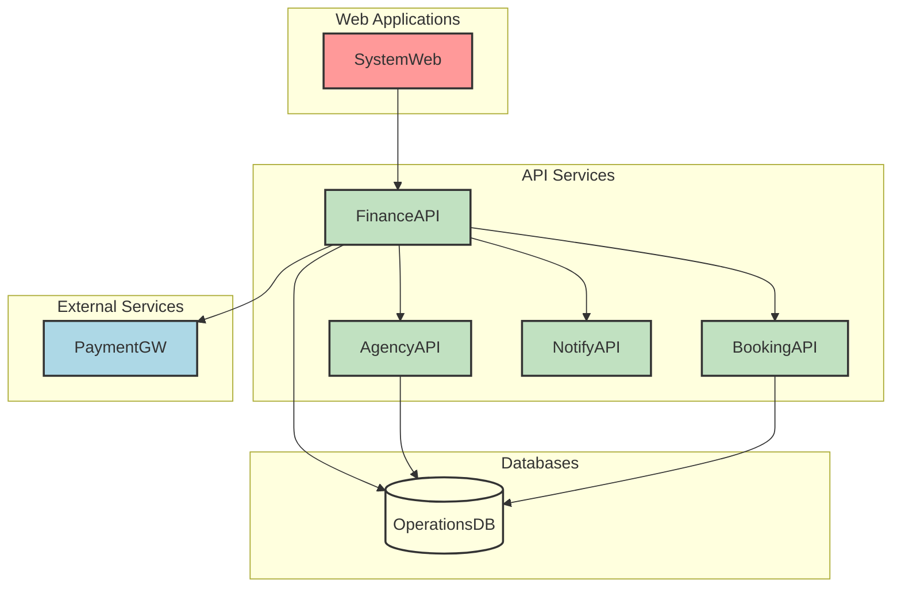
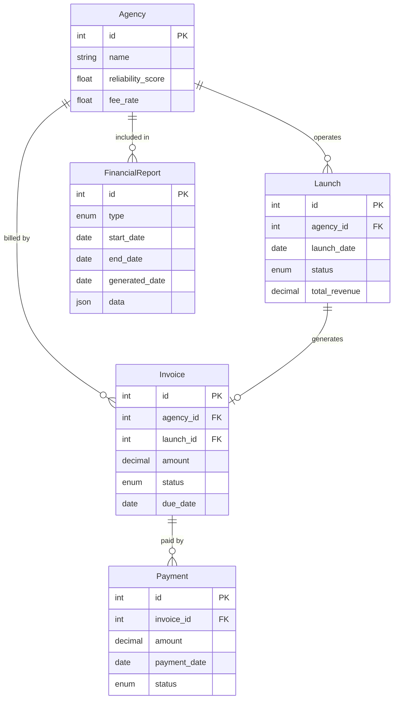

# AstroBookings: Financial Operations Domain

> Timestamp: 2024-08-21 10:00:00 UTC

The Financial Operations domain in AstroBookings manages all monetary aspects of the space travel business. It addresses the challenges of invoicing agencies, tracking payments, and generating financial reports in the context of high-value space travel transactions.

Our solution provides a robust financial management system that automates invoice generation, handles payment processing, and offers comprehensive financial reporting. It ensures accurate billing based on launch success and agency reliability, while providing transparency in financial operations.

## User Stories

### 3.1 As an employee, I want to generate invoices for agencies based on successful launches, applying different fee rates based on agency reliability.

- Automatically trigger invoice generation upon successful launch completion.
- Apply fee rates based on agency reliability (1% for new agencies, 0.8% for reliable agencies).
- Calculate the fee based on the total revenue from the launch.
- Generate a detailed invoice including launch information, number of passengers, total revenue, and fee amount.
- Store the generated invoice in the system and link it to the corresponding launch and agency.

### 3.2 As an employee, I want to generate invoices for agencies for aborted launches to cover platform usage costs.

- Automatically trigger invoice generation when a launch is marked as aborted.
- Apply a fixed fee (e.g., 1000 USD) for platform usage costs.
- Generate an invoice including the aborted launch details and the fixed fee amount.
- Store the generated invoice and link it to the corresponding launch and agency.

### 3.3 As an employee, I want to track payment status of invoices.

- Provide a dashboard to view all generated invoices and their current payment status.
- Implement functionality to update payment status (e.g., pending, partially paid, paid, overdue).
- Set up automated reminders for overdue invoices.
- Generate reports on payment trends and outstanding balances.

### 3.4 As an employee, I want to view a revenue report for each agency to analyze their financial performance.

- Create a reporting interface to select an agency and a date range for the report.
- Generate a detailed report showing all launches, their revenues, applied fees, and total earnings for the selected period.
- Include metrics such as number of successful launches, number of aborted launches, and average revenue per launch.
- Provide options to export the report in various formats (e.g., PDF, CSV).

### 3.5 As an employee, I want to generate an annual report of actual and pending revenues to assess the overall financial health of the platform.

- Develop functionality to generate a comprehensive annual financial report.
- Include sections for actual received revenue, pending payments, and projections based on scheduled launches.
- Break down revenue by agency, month, and launch type.
- Incorporate visual representations (graphs, charts) of the financial data.
- Allow for easy comparison with previous years' data.

## Affected Components

### 🌐 Web Applications

- `🌐 SystemWeb`: Provides interface for employees to manage financial operations and view reports.

### 🧑‍💼 API Services

- `🧑‍💼 FinanceAPI`: Handles all financial calculations, invoice generation, and report creation.
- `🧑‍💼 AgencyAPI`: Provides agency and launch information for financial operations.
- `🧑‍💼 BookingAPI`: Supplies booking data necessary for revenue calculations.
- `🧑‍💼 NotifyAPI`: Sends notifications related to invoices and payments.

### 📇 Databases

- `📇 OperationsDB`: Stores financial transaction data, invoices, and payment records.

### 👽 External Services

- `👽 PaymentGW`: Processes payments for invoices.

## Component Interfaces

This diagram illustrates the interfaces between the components involved in the Financial Operations domain:

1. SystemWeb interacts with FinanceAPI for all financial management operations.
2. FinanceAPI communicates with other APIs (AgencyAPI, BookingAPI, NotifyAPI) to gather necessary data for financial operations.
3. FinanceAPI interacts with OperationsDB for storing and retrieving financial data.
4. FinanceAPI connects to the external PaymentGW for processing payments.

## Related Entities

1. `Invoice`: 
   - Represents a bill generated for an agency for a specific launch or service.
   - Contains fields such as id, agency_id, launch_id, amount, status, due_date.

2. `Payment`: 
   - Represents a payment made by an agency for an invoice.
   - Contains fields such as id, invoice_id, amount, date, status.

3. `Agency`: 
   - Represents a space agency using the platform.
   - Contains fields such as id, name, reliability_score, fee_rate.

4. `Launch`: 
   - Represents a space launch event.
   - Contains fields such as id, agency_id, date, status, total_revenue.

5. `FinancialReport`: 
   - Represents a generated financial report.
   - Contains fields such as id, type, date_range, generated_date, data.

## Entity-Relationship Diagram

This ERD shows the following relationships:

1. An `Agency` can operate multiple `Launches` (one-to-many relationship).
2. An `Agency` can be billed by multiple `Invoices` (one-to-many relationship).
3. A `Launch` can generate one `Invoice` (one-to-one relationship).
4. An `Invoice` can have multiple `Payments` (one-to-many relationship).
5. An `Agency` can be included in multiple `FinancialReports` (one-to-many relationship).

</antArt