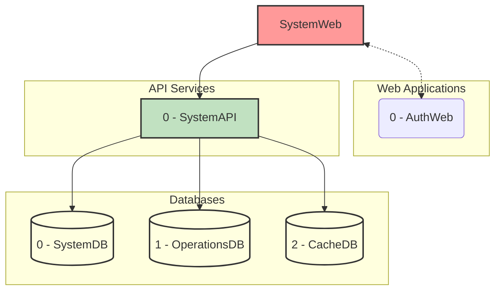
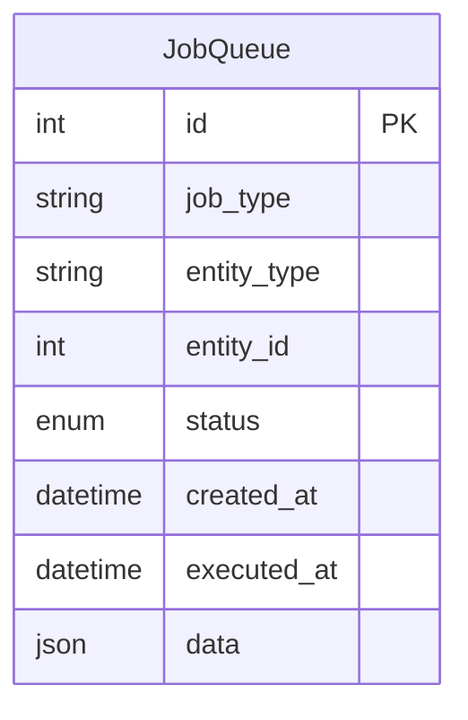

# AstroBookings: Data Synchronization Domain

> Timestamp: 2024-08-21 14:00:00 UTC

The Data Synchronization domain in AstroBookings allows IT employees to manage and initiate synchronization processes between databases. It ensures data consistency across different parts of the system.

## User Stories

### 5.1 As a system, I want to record the origin of each data change for accurate synchronization.

- Implement a mechanism to track the source of each data change.
- Store this information along with the change details in the synchronization queue.

### 5.2 As an IT employee, I want to initiate synchronization processes between databases.

- Create an interface for IT employees to manually trigger synchronization processes.
- Implement safeguards to prevent conflicts during synchronization.
- Provide options to synchronize specific data sets or all data.

### 5.3 As an IT employee, I want to monitor the status of data synchronization processes.

- Develop a dashboard to display ongoing and completed synchronization processes.
- Show information such as start time, completion percentage, and any errors encountered.
- Implement alerts for failed synchronization attempts.

## Affected Components

### 🌐 Web Applications

- `🌐 SystemWeb`: Administrative interface for AstroBookings employees.

### 🧑‍💼 API Services

- `🧑‍💼 SystemAPI`: Manages data synchronization between databases.

### 📇 Databases

- `📇 OperationsDB`: Stores structured data for bookings, launches, and financial transactions.
- `📇 SystemDB`: Stores user profiles, authentication data, system logs, notification queue, and sync operations queue.
- `📇 CacheDB`: Provides quick data access for public website and traveler portal.

## Component Interfaces

This diagram illustrates the interfaces between the components involved in the Data Synchronization domain:

1. SystemWeb interacts with SyncAPI for managing synchronization processes.
2. SyncAPI interacts with all three databases (OperationsDB, SystemDB, CacheDB) to perform synchronization tasks.

## Related Entities

1. `JobQueue`:
   - Represents pending tasks for data synchronization between different parts of the system.
   - Contains fields such as id, job_type, entity_type, entity_id, status, created_at, executed_at, data.

### Entity Relationship Diagram

This entity is not directly related to the existing entities.
Indirectly reference other entities in the system by:

- `entity_type`: The type of entity being synchronized.
- `entity_id`: The ID of the entity being synchronized.

---

## [🚀 AstroBookings](https://github.com/AstroBookings)
