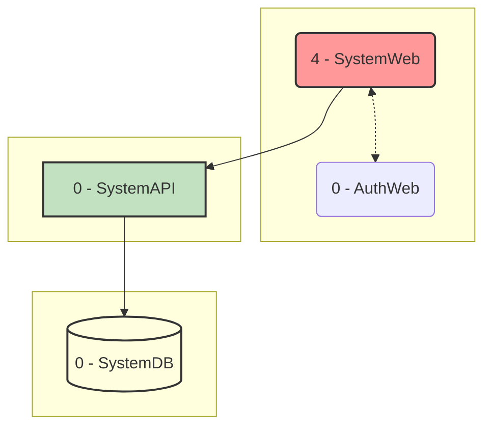
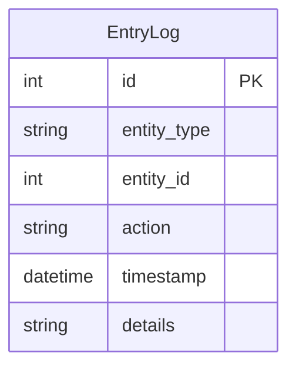

# AstroBookings: System Monitoring Domain

> Timestamp: 2024-08-21 17:00:00 UTC

The System Monitoring domain in AstroBookings provides logging and system status monitoring for IT operations. It ensures that the platform's activities are tracked and that the system's health can be monitored effectively.

## User Stories

### 6.1 As a system, I want to save logs of all activities to maintain a record of what has happened.

- Implement a robust logging system that captures all significant system events.
- Include relevant details such as timestamp, event type, and associated user/process.
- Ensure logs are stored securely and are easily searchable.

### 6.2 As an IT employee, I want to view system logs to monitor system behavior.

- Create a user interface for IT employees to view and analyze system logs.
- Implement filtering and search functionality to easily find relevant log entries.
- Provide options to export logs for further analysis.

### 6.3 As an IT employee, I want to check the status of the notification service.

- Develop a dashboard specifically for monitoring the notification service.
- Display metrics such as service uptime, number of notifications sent/failed, and current queue size.
- Implement real-time updates for the dashboard.

## Affected Components

### 🌐 Web Applications

- `🌐 SystemWeb`: Administrative interface for AstroBookings employees.

### 🧑‍💼 API Services

- `🧑‍💼 SystemAPI`: Handles authentication, authorization, and system-wide operations.

### 📇 Databases

- `📇 SystemDB`: Stores user profiles, authentication data, system logs, notification queue, and sync operations queue.

## Component Interfaces

This diagram illustrates the interfaces between the components involved in the System Monitoring domain:

1. SystemWeb interacts with SystemAPI for accessing monitoring functionalities.
2. SystemAPI interacts with SystemDB for storing and retrieving system logs and monitoring data.

## Related Entities

1. `EntryLog`:
   - Represents system activity logs, used for monitoring and auditing.
   - Contains fields such as id, entity_type, entity_id, action, timestamp, details.

## Entity-Relationship Diagram

This entity is not directly related to the existing entities.
Indirectly reference other entities in the system by:

- `entity_type`: The type of entity being synchronized.
- `entity_id`: The ID of the entity being synchronized.

---

## [🚀 AstroBookings](https://github.com/AstroBookings)
