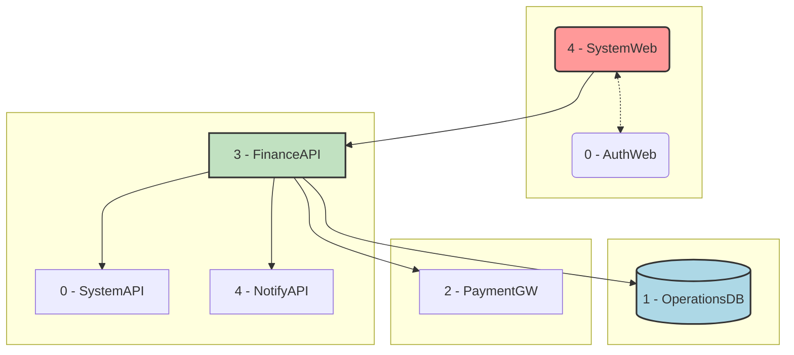
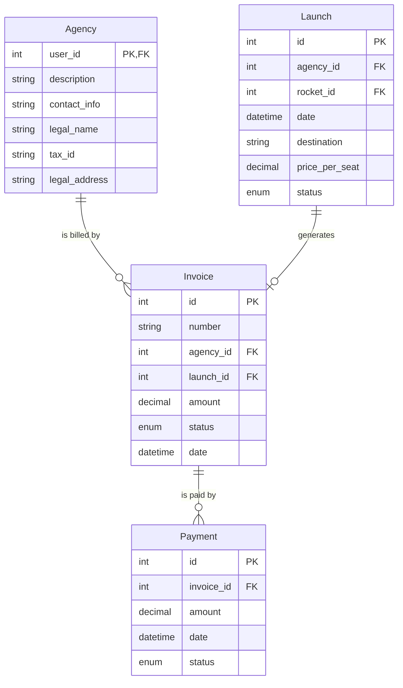

# AstroBookings: Financial Operations Domain

> Timestamp: 2024-08-21 16:00:00 UTC

The Financial Operations domain in AstroBookings handles invoicing, payments, and financial reporting for the space travel platform.

## User Stories

### 3.1 As an employee, I want to generate invoices for agencies based on successful launches, applying different fee rates based on agency reliability.

- Implement an invoice generation system for successful launches.
- Apply fee rates based on agency reliability (1% for new agencies, 0.8% for reliable agencies).
- Include all necessary information on the invoice (launch details, number of passengers, total revenue, fee amount).

### 3.2 As an employee, I want to generate invoices for agencies for aborted launches to cover platform usage costs.

- Create a system to generate fixed-fee invoices (1000 USD) for aborted launches.
- Include relevant details such as the aborted launch information and reason for abort if available.

### 3.3 As an employee, I want to track payment status of invoices.

- Implement a system to record and update payment status of invoices.
- Provide options to mark invoices as paid, partially paid, or overdue.
- Set up automated reminders for overdue invoices.

### 3.4 As an employee, I want to view a revenue report for each agency to analyze their financial performance.

- Generate detailed revenue reports for each agency.
- Include information such as number of launches, total revenue, fees paid, and reliability status.
- Provide options to view reports for different time periods (monthly, quarterly, annually).

### 3.5 As an employee, I want to generate an annual report of actual and pending revenues to assess the overall financial health of the platform.

- Create a comprehensive annual financial report.
- Include actual revenue received, pending payments, and projections based on scheduled launches.
- Provide a breakdown of revenue by agency and by month.
- Generate visual representations (graphs, charts) of the financial data.

## Affected Components

### 🌐 Web Applications

- `🌐 SystemWeb`: Administrative interface for AstroBookings employees.

### 🧑‍💼 API Services

- `🧑‍💼 FinanceAPI`: Manages invoicing and payments.

### 📇 Databases

- `📇 OperationsDB`: Stores structured data for bookings, launches, and financial transactions.

### 👽 External Services

- `👽 PaymentGW`: For processing payments.

## Component Interfaces

This diagram illustrates the interfaces between the components involved in the Financial Operations domain:

1. SystemWeb interacts with FinanceAPI for all financial management operations.
2. FinanceAPI interacts with OperationsDB for storing and retrieving financial data.
3. FinanceAPI connects to the external PaymentGW for processing payments.

## Related Entities

1. `Agency`:

   - Represents a space agency offering launch services.
   - Contains fields such as id, name, description, contact information.

2. `Launch`:

   - Represents a scheduled space trip.
   - Contains fields such as id, agency_id, rocket_id, date, destination, price_per_seat, available_seats, status.

3. `Invoice`:

   - Represents charges generated for agencies for completed launches.
   - Contains fields such as id, number, agency_id, launch_id, amount, status, date.

4. `Payment`:
   - Represents payments made by agencies to settle issued invoices.
   - Contains fields such as id, invoice_id, amount, date, status.

### Entity Relationship Diagram

This ERD shows the following relationships:

- An `Agency` can be billed by multiple `Invoice` records.
- A `Launch` can one `Invoice` record.
- An `Invoice` can be paid by multiple `Payment` records.

---

## [🚀 AstroBookings](https://github.com/AstroBookings)
