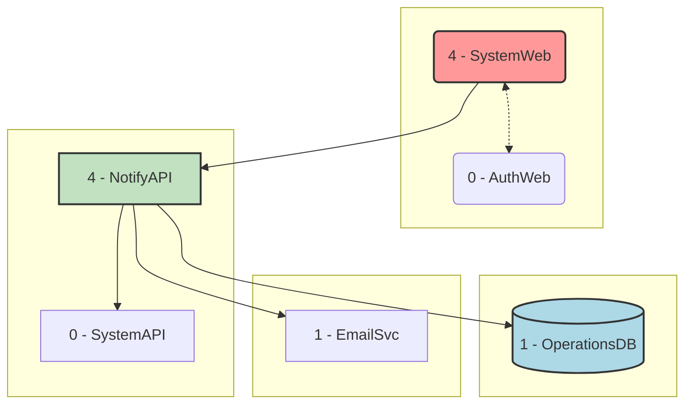
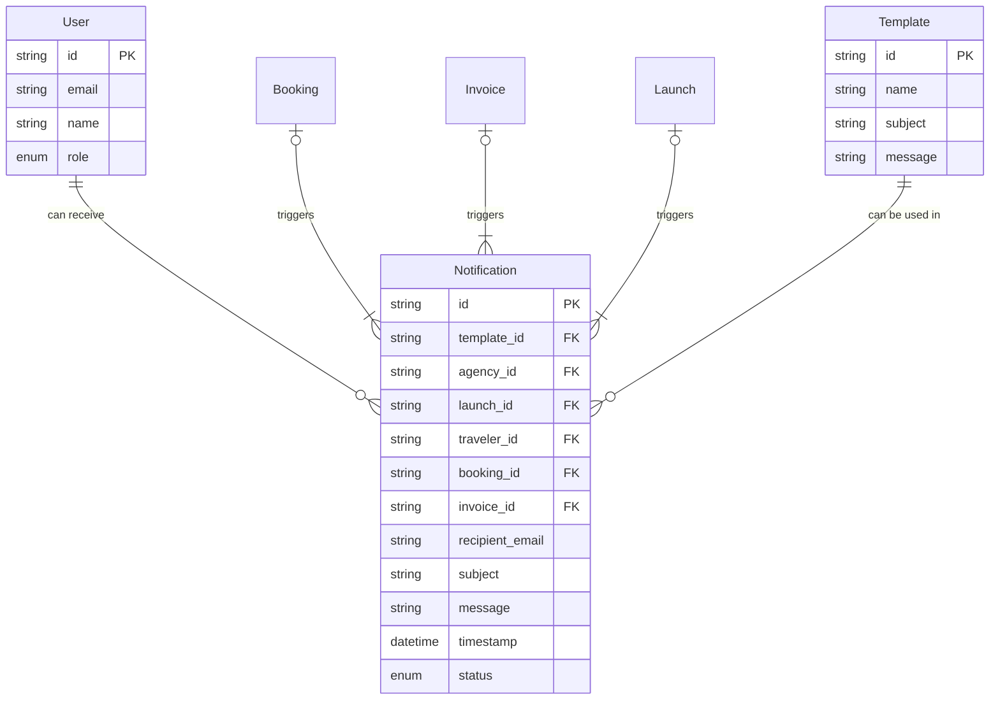

# AstroBookings: Notification System Domain

> Timestamp: 2024-08-21 13:00:00 UTC

The Notification System domain in AstroBookings manages communication with users about bookings, launches, and other events. It ensures that agencies, travelers, and employees receive timely and relevant information.

## User Stories

### 4.1 As an agency, I want to receive email notifications about my launches so that I can stay informed about their status, bookings, and cancellations.

- Implement email notifications for agencies regarding launch status updates.
- Send notifications about new bookings and cancellations for their launches.
- Include relevant details such as launch date, number of seats booked/cancelled.

### 4.2 As a traveler, I want to receive email notifications about my bookings so that I can stay informed about cancellations, delays, or aborts of my booked launches.

- Set up email notifications for travelers regarding their bookings.
- Send notifications about any changes to their booked launches (delays, aborts, etc.).
- Include essential information like updated launch times, refund details (if applicable).

### 4.3 As a VIP traveler, I want to receive exclusive notifications about new launches so that I can book early.

- Implement a system to identify VIP travelers.
- Create a separate notification process for VIP travelers.
- Send early notifications about new launches to VIP travelers.

### 4.4 As an IT employee, I want to view the status of the notification queue so that I can ensure proper system operation.

- Create a dashboard for monitoring the notification queue.
- Display information such as number of pending notifications, successful sends, and failed attempts.
- Implement filtering and sorting options for the queue.

### 4.5 As an IT employee, I want to change the status of notifications so that I can manage the notification system effectively.

- Implement functionality to manually update the status of notifications.
- Provide options to mark notifications as sent or deleted.
- Implement proper access controls for these actions.

## Affected Components

### 🌐 Web Applications

- `🌐 SystemWeb`: Administrative interface for AstroBookings employees.

### 🧑‍💼 API Services

- `🧑‍💼 NotifyAPI`: Handles email notifications.

### 📇 Databases

- `📇 OperationsDB`: Stores notification queue and user communication preferences.

### 👽 External Services

- `👽 EmailSvc`: For sending notifications.

## Component Interfaces

This diagram illustrates the interfaces between the components involved in the Notification System domain:

1. SystemWeb interacts with NotifyAPI for notification management.
2. NotifyAPI interacts with OperationsDB for storing and retrieving notification data.
3. NotifyAPI connects to the external EmailSvc for sending email notifications.

## Related Entities

1. `Notification`:

   - Represents messages sent to system users about various events.
   - Contains fields such as id, recipient_email, subject, message, timestamp, status.

> Other related entities include `Agency` or `Traveler`, and `Launch` , `Booking` or `Invoice`, which are not directly involved in the notification system but are relevant for sending notifications to the respective users.

2. `User`:

   - Represents system users as a generalization for agencies or travelers
   - Contains fields such as id, email, name, role.

3. `Launch`, `Booking`, or `Invoice`:

   - Relevant entities related to the events for which notifications are sent.
   - Provide context for the notifications being sent.

4. `Template`:

   - Contains predefined message templates for notifications.
   - Includes fields such as id, name, subject, message.

### Entity Relationship Diagram

This ERD shows the following relationships:

- A `User` can have multiple `Notification` messages.
- A `Template` can be used in multiple `Notification` messages.

---

## [🚀 AstroBookings](https://github.com/AstroBookings)
