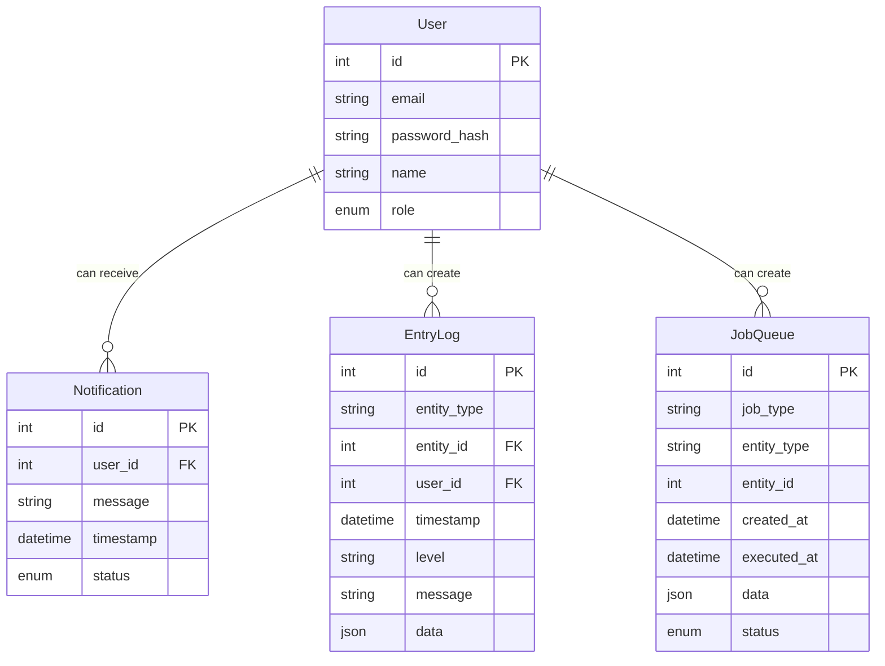

# AstroBookings: System Schema

This schema describes the documental `📇 SystemDB` of the AstroBookings platform.

## Entities



## MongoDB Collections and Schemas

### Users Collection

```js
db.createCollection("users", {
  validator: {
    $jsonSchema: {
      bsonType: "object",
      required: ["email", "password_hash", "name", "role"],
      properties: {
        email: {
          bsonType: "string",
          description: "must be a string and is required",
        },
        password_hash: {
          bsonType: "string",
          description: "must be a string and is required",
        },
        name: {
          bsonType: "string",
          description: "must be a string and is required",
        },
        role: {
          enum: ["admin", "agency", "traveler"],
          description: "must be one of the enum values and is required",
        },
      },
    },
  },
});
```

### Notifications Collection

```js
db.createCollection("notifications", {
  validator: {
    $jsonSchema: {
      bsonType: "object",
      required: ["userId", "message", "timestamp", "status"],
      properties: {
        userId: {
          bsonType: "int",
          description: "must be an integer and is required",
        },
        message: {
          bsonType: "string",
          description: "must be a string and is required",
        },
        timestamp: {
          bsonType: "date",
          description: "must be a date and is required",
        },
        status: {
          enum: ["unread", "read", "sent"],
          description: "must be one of the enum values and is required",
        },
      },
    },
  },
});
```

### EntryLogs Collection

```js
db.createCollection("entry_log", {
  validator: {
    $jsonSchema: {
      bsonType: "object",
      required: ["level", "message", "timestamp"],
      properties: {
        entityType: {
          bsonType: "string",
          description: "must be a string",
        },
        entity_id: {
          bsonType: "int",
          description: "must be an integer",
        },
        user_id: {
          bsonType: "int",
          description: "must be an integer",
        },
        level: {
          enum: ["info", "warning", "error"],
          description: "must be one of the enum values and is required",
        },
        message: {
          bsonType: "string",
          description: "must be a string ",
        },
        timestamp: {
          bsonType: "date",
          description: "must be a date and is required",
        },
        data: {
          bsonType: "string",
          description: "must be a string",
        },
      },
    },
  },
});
```

### JobsQueue Collection

```js
db.createCollection("job_queue", {
  validator: {
    $jsonSchema: {
      bsonType: "object",
      required: [
        "job_type",
        "entity_type",
        "entity_id",
        "status",
        "created_at",
        "executed_at",
        "data",
      ],
      properties: {
        job_type: {
          bsonType: "string",
          description: "must be a string and is required",
        },
        entity_type: {
          bsonType: "string",
          description: "must be a string and is required",
        },
        entity_id: {
          bsonType: "int",
          description: "must be an integer and is required",
        },
        status: {
          enum: ["pending", "completed", "failed"],
          description: "must be one of the enum values and is required",
        },
        created_at: {
          bsonType: "date",
          description: "must be a date and is required",
        },
        executed_at: {
          bsonType: "date",
          description: "must be a date and is required",
        },
        data: {
          bsonType: "object",
          description: "must be an object and is required",
        },
      },
    },
  },
});
```
