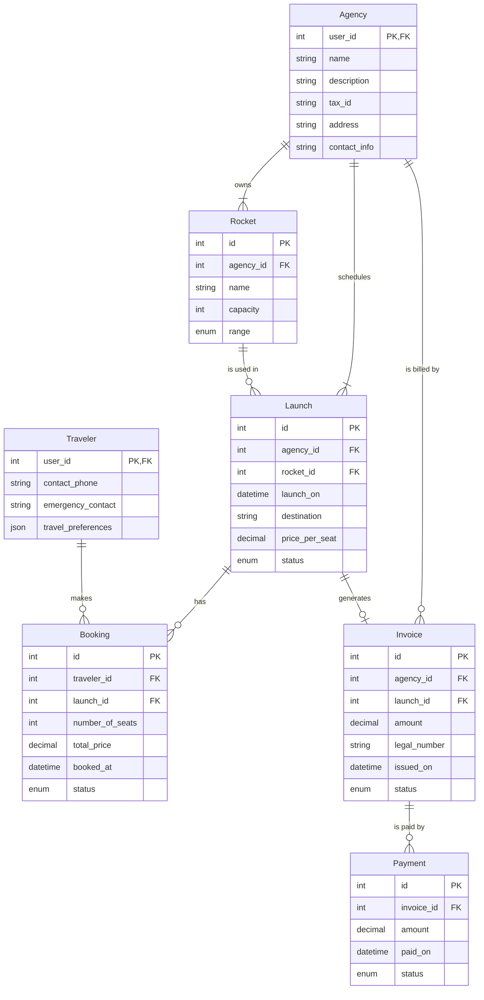

# AstroBookings: Operations Schema

This schema describes the relational `📇 OperationsDB` of the AstroBookings platform.

## Entities



## PostgreSQL Tables and Schemas

### Travelers Table

This schema describes the relational `📇 OperationsDB` of the AstroBookings platform.

### Travelers Table

```sql
CREATE TABLE IF NOT EXISTS travelers (
  user_id BIGINT PRIMARY KEY,
  contact_phone TEXT,
  emergency_contact TEXT,
  travel_preferences JSON
);
```

### Agencies Table

```sql
CREATE TABLE IF NOT EXISTS agencies (
  user_id BIGINT PRIMARY KEY,
  name TEXT NOT NULL,
  description TEXT,
  tax_id TEXT NOT NULL,
  address TEXT NOT NULL,
  contact_info TEXT
);
```

### Rockets Table

```sql
CREATE TABLE IF NOT EXISTS rockets (
  id BIGINT PRIMARY KEY GENERATED ALWAYS AS IDENTITY,
  agency_id BIGINT NOT NULL REFERENCES agencies(user_id),
  name TEXT NOT NULL,
  capacity INT DEFAULT 8,
  range TEXT CHECK (range IN ('low-earth-orbit', 'geostationary', 'interplanetary'))
);
```

### Launches Table

```sql
CREATE TABLE IF NOT EXISTS launches (
  id BIGINT PRIMARY KEY GENERATED ALWAYS AS IDENTITY,
  agency_id BIGINT NOT NULL REFERENCES agencies(user_id),
  rocket_id BIGINT NOT NULL REFERENCES rockets(id),
  launch_on DATE NOT NULL,
  destination TEXT NOT NULL,
  price_per_seat NUMERIC NOT NULL,
  status TEXT CHECK (status IN ('scheduled', 'launched', 'aborted'))
);
```

### Bookings Table

```sql
CREATE TABLE bookings (
  id BIGINT PRIMARY KEY GENERATED ALWAYS AS IDENTITY,
  traveler_id BIGINT NOT NULL REFERENCES travelers(user_id),
  launch_id BIGINT NOT NULL REFERENCES launches(id),
  number_of_seats INT DEFAULT 1,
  booked_at TIMESTAMP DEFAULT NOW(),
  status TEXT CHECK (status IN('reserved', 'cancelled', 'launched', 'aborted'))
);
```

### Invoices Table

```sql
CREATE TABLE invoices (
  id BIGINT PRIMARY KEY GENERATED ALWAYS AS IDENTITY,
  agency_id BIGINT REFERENCES agencies(user_id),
  launch_id BIGINT REFERENCES launches(id),
  amount NUMERIC NOT NULL,
  legal_number TEXT NOT NULL,
  issued_on DATE DEFAULT NOW(),
  status TEXT CHECK (status IN ('pending', 'paid', 'cancelled'))
);
```

### Payments Table

```sql
CREATE TABLE payments (
  id BIGINT PRIMARY KEY GENERATED ALWAYS AS IDENTITY,
  invoice_id BIGINT NOT NULL REFERENCES invoices(id),
  amount NUMERIC,
  paid_on DATE,
  status TEXT CHECK (status IN ('paid', 'failed'))
);
```
