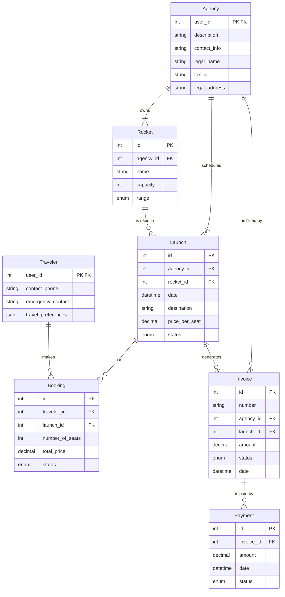

# AstroBookings: Operations Schema

This schema describes the relational `📇 OperationsDB` of the AstroBookings platform.

## Entities



## PostgreSQL Tables and Schemas

### Travelers Table

This schema describes the relational `📇 OperationsDB` of the AstroBookings platform.

## Entities


## PostgreSQL Tables and Schemas

### Travelers Table

```sql
CREATE TABLE travelers (
  user_id BIGINT PRIMARY KEY,
  contact_phone TEXT,
  emergency_contact TEXT,
  travel_preferences json
);
```

### Agencies Table

```sql
CREATE TABLE agencies (
  user_id BIGINT PRIMARY KEY,
  description TEXT,
  contact_info TEXT,
  legal_name TEXT,
  tax_id TEXT,
  legal_address TEXT
);
```

### Rockets Table

```sql
CREATE TABLE rockets (
  id BIGINT PRIMARY KEY GENERATED ALWAYS AS IDENTITY,
  agency_id BIGINT REFERENCES agencies(user_id),
  name TEXT,
  capacity INT,
  rocket_range ENUM('low-earth-orbit', 'geostationary', 'interplanetary')
);
```

### Launches Table

```sql
CREATE TABLE launches (
  id BIGINT PRIMARY KEY GENERATED ALWAYS AS IDENTITY,
  agency_id BIGINT REFERENCES agencies(user_id),
  rocket_id BIGINT REFERENCES rockets(id),
  launch_date TIMESTAMPTZ,
  destination TEXT,
  price_per_seat NUMERIC,
  launch_status ENUM('scheduled', 'launched', 'aborted')
);
```

### Bookings Table

```sql
CREATE TABLE bookings (
  id BIGINT PRIMARY KEY GENERATED ALWAYS AS IDENTITY,
  traveler_id BIGINT REFERENCES travelers(user_id),
  launch_id BIGINT REFERENCES launches(id),
  number_of_seats INT,
  total_price NUMERIC,
  booking_status ENUM('reserved', 'cancelled', 'launched', 'aborted')
);
```

### Invoices Table

```sql
CREATE TABLE invoices (
  id BIGINT PRIMARY KEY GENERATED ALWAYS AS IDENTITY,
  invoice_number TEXT,
  agency_id BIGINT REFERENCES agencies(user_id),
  launch_id BIGINT REFERENCES launches(id),
  amount NUMERIC,
  status ENUM('pending', 'paid', 'cancelled'),
  invoice_date TIMESTAMPTZ,
);
```

### Payments Table

```sql
CREATE TABLE payments (
  id BIGINT PRIMARY KEY GENERATED ALWAYS AS IDENTITY,
  invoice_id BIGINT REFERENCES invoices(id),
  amount NUMERIC,
  payment_date TIMESTAMPTZ,
  payment_status ENUM('paid', 'failed')
);
```
