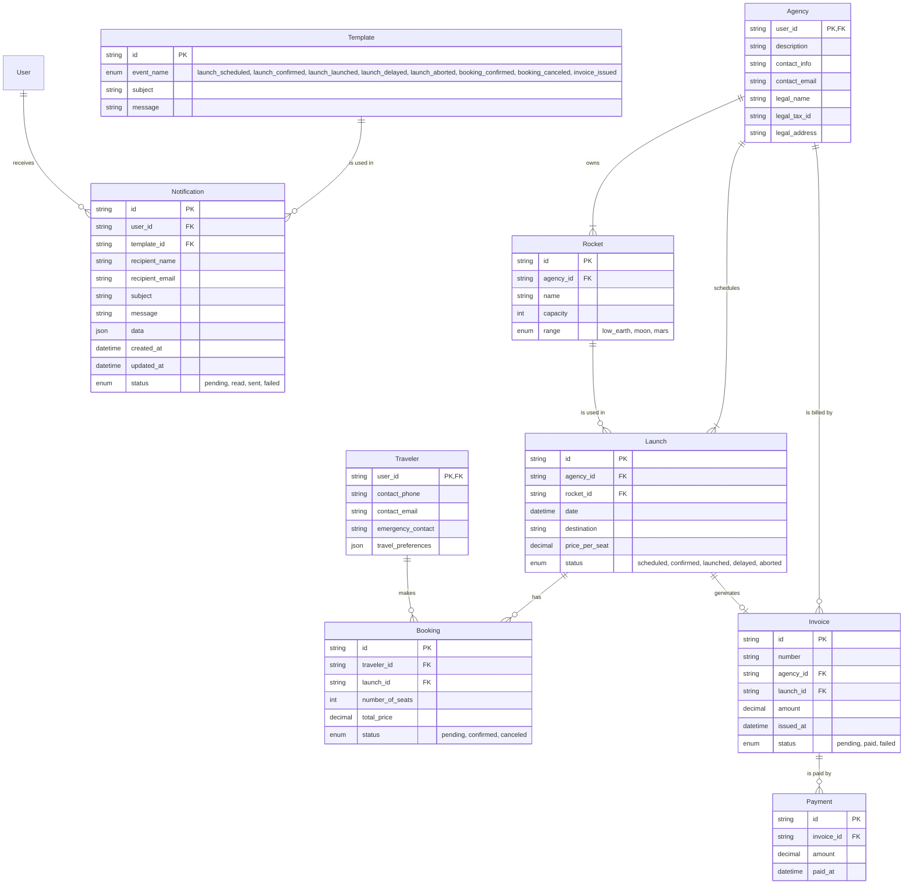

# AstroBookings: Operations Schema

This schema describes the relational `📇 OperationsDB` of the AstroBookings platform.

## Entities



### Travelers Table

## PostgreSQL Tables and Schemas

### Travelers Table

```sql
CREATE TABLE IF NOT EXISTS travelers (
  user_id TEXT PRIMARY KEY,
  contact_phone TEXT,
  contact_email TEXT NOT NULL,
  emergency_contact TEXT,
  travel_preferences JSON
);
```

### Agencies Table

```sql
CREATE TABLE IF NOT EXISTS agencies (
  user_id TEXT PRIMARY KEY,
  description TEXT,
  contact_info TEXT,
  contact_email TEXT NOT NULL,
  legal_name TEXT NOT NULL,
  legal_tax_id TEXT NOT NULL,
  legal_address TEXT NOT NULL
);
```

### Rockets Table

```sql
CREATE TABLE IF NOT EXISTS rockets (
  id TEXT PRIMARY KEY DEFAULT gen_random_uuid(),
  agency_id TEXT NOT NULL REFERENCES agencies(user_id),
  name TEXT NOT NULL,
  capacity INT NOT NULL,
  range TEXT CHECK (range IN ('low_earth', 'moon', 'mars'))
);
```

### Launches Table

```sql
CREATE TABLE IF NOT EXISTS launches (
  id TEXT PRIMARY KEY DEFAULT gen_random_uuid(),
  agency_id TEXT NOT NULL REFERENCES agencies(user_id),
  rocket_id TEXT NOT NULL REFERENCES rockets(id),
  date TIMESTAMP NOT NULL,
  destination TEXT NOT NULL,
  price_per_seat NUMERIC NOT NULL,
  status TEXT CHECK (status IN ('scheduled', 'confirmed', 'launched', 'delayed', 'aborted'))
);
```

### Bookings Table

```sql
CREATE TABLE bookings (
  id TEXT PRIMARY KEY DEFAULT gen_random_uuid(),
  traveler_id TEXT NOT NULL REFERENCES travelers(user_id),
  launch_id TEXT NOT NULL REFERENCES launches(id),
  number_of_seats INT NOT NULL,
  total_price NUMERIC NOT NULL,
  status TEXT CHECK (status IN('pending', 'confirmed', 'canceled'))
);
```

### Invoices Table

```sql
CREATE TABLE invoices (
  id TEXT PRIMARY KEY DEFAULT gen_random_uuid(),
  number TEXT NOT NULL,
  agency_id TEXT NOT NULL REFERENCES agencies(user_id),
  launch_id TEXT NOT NULL REFERENCES launches(id),
  amount NUMERIC NOT NULL,
  issued_at TIMESTAMP DEFAULT NOW(),
  status TEXT CHECK (status IN ('pending', 'paid', 'failed'))
);
```

### Payments Table

```sql
CREATE TABLE payments (
  id TEXT PRIMARY KEY DEFAULT gen_random_uuid(),
  invoice_id TEXT NOT NULL REFERENCES invoices(id),
  amount NUMERIC NOT NULL,
  paid_at TIMESTAMP DEFAULT NOW()
);
```

### Notifications Table

```sql
CREATE TABLE notifications (
  id TEXT PRIMARY KEY DEFAULT gen_random_uuid(),
  user_id TEXT NOT NULL REFERENCES agencies(user_id),
  template_id TEXT NOT NULL REFERENCES templates(id),
  recipient_name TEXT NOT NULL,
  recipient_email TEXT NOT NULL,
  subject TEXT NOT NULL,
  message TEXT NOT NULL,
  data JSON,
  created_at TIMESTAMP DEFAULT NOW(),
  updated_at TIMESTAMP DEFAULT NOW(),
  status TEXT CHECK (status IN ('pending', 'read', 'sent', 'failed'))
);
```

### Templates Table

```sql
CREATE TABLE templates (
  id TEXT PRIMARY KEY DEFAULT gen_random_uuid(),
  event_name TEXT CHECK (event_name IN ('launch_scheduled', 'launch_confirmed', 'launch_launched', 'launch_delayed', 'launch_aborted', 'booking_confirmed', 'booking_canceled', 'invoice_issued')),
  subject TEXT NOT NULL,
  message TEXT NOT NULL
);
```
