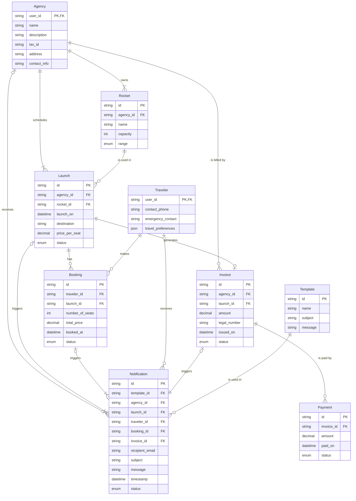

# AstroBookings: Operations Schema

This schema describes the relational `📇 OperationsDB` of the AstroBookings platform.

## Entities



## PostgreSQL Tables and Schemas

### Travelers Table

```sql
CREATE TABLE IF NOT EXISTS travelers (
  user_id TEXT PRIMARY KEY,
  contact_phone TEXT,
  emergency_contact TEXT,
  travel_preferences JSON
);
```

### Agencies Table

```sql
DROP TABLE IF EXISTS agencies CASCADE;
CREATE TABLE IF NOT EXISTS agencies (
  user_id TEXT PRIMARY KEY,
  name TEXT NOT NULL,
  description TEXT,
  tax_id TEXT NOT NULL,
  address TEXT NOT NULL,
  contact_info TEXT
);
```

### Rockets Table

```sql
DROP TABLE IF EXISTS rockets CASCADE;
CREATE TABLE IF NOT EXISTS rockets (
  id TEXT PRIMARY KEY DEFAULT gen_random_uuid(),
  agency_id TEXT NOT NULL REFERENCES agencies(user_id),
  name TEXT NOT NULL,
  capacity INT DEFAULT 8,
  range TEXT CHECK (range IN ('low-earth-orbit', 'geostationary', 'interplanetary'))
);
```

### Launches Table

```sql
DROP TABLE IF EXISTS launches CASCADE;
CREATE TABLE IF NOT EXISTS launches (
  id TEXT PRIMARY KEY DEFAULT gen_random_uuid(),
  agency_id TEXT NOT NULL REFERENCES agencies(user_id),
  rocket_id TEXT NOT NULL REFERENCES rockets(id),
  launch_on DATE NOT NULL,
  destination TEXT NOT NULL,
  price_per_seat NUMERIC NOT NULL,
  status TEXT CHECK (status IN ('scheduled', 'launched', 'aborted'))
);
```

### Bookings Table

```sql
DROP TABLE IF EXISTS bookings CASCADE;
CREATE TABLE bookings (
  id TEXT PRIMARY KEY DEFAULT gen_random_uuid(),
  traveler_id TEXT NOT NULL REFERENCES travelers(user_id),
  launch_id TEXT NOT NULL REFERENCES launches(id),
  number_of_seats INT DEFAULT 1,
  booked_at TIMESTAMP DEFAULT NOW(),
  status TEXT CHECK (status IN('reserved', 'cancelled', 'launched', 'aborted'))
);
```

### Invoices Table

```sql
DROP TABLE IF EXISTS invoices CASCADE;
CREATE TABLE invoices (
  id TEXT PRIMARY KEY DEFAULT gen_random_uuid(),
  agency_id TEXT REFERENCES agencies(user_id),
  launch_id TEXT REFERENCES launches(id),
  amount NUMERIC NOT NULL,
  legal_number TEXT NOT NULL,
  issued_on DATE DEFAULT NOW(),
  status TEXT CHECK (status IN ('pending', 'paid', 'cancelled'))
);
```

### Payments Table

```sql
DROP TABLE IF EXISTS payments CASCADE;
CREATE TABLE payments (
  id TEXT PRIMARY KEY DEFAULT gen_random_uuid(),
  invoice_id TEXT NOT NULL REFERENCES invoices(id),
  amount NUMERIC,
  paid_on DATE DEFAULT NOW(),
  status TEXT CHECK (status IN ('paid', 'failed'))
);
```

### Notifications Table

```sql
DROP TABLE IF EXISTS notifications CASCADE;
CREATE TABLE notifications (
  id TEXT PRIMARY KEY DEFAULT gen_random_uuid(),
  template_id TEXT NOT NULL REFERENCES templates(id),
  agency_id TEXT REFERENCES agencies(user_id),
  launch_id TEXT REFERENCES launches(id),
  traveler_id TEXT REFERENCES travelers(user_id),
  booking_id TEXT REFERENCES bookings(id),
  invoice_id TEXT REFERENCES invoices(id),
  recipient_email TEXT NOT NULL,
  subject TEXT NOT NULL,
  message TEXT NOT NULL,
  timestamp TIMESTAMP DEFAULT NOW(),
  status TEXT CHECK (status IN ('pending', 'read', 'sent', 'failed'))
);

```

### Templates Table

```sql
DROP TABLE IF EXISTS templates CASCADE;
CREATE TABLE templates (
  id TEXT PRIMARY KEY DEFAULT gen_random_uuid(),
  name TEXT NOT NULL,
  subject TEXT NOT NULL,
  message TEXT NOT NULL
);
```
