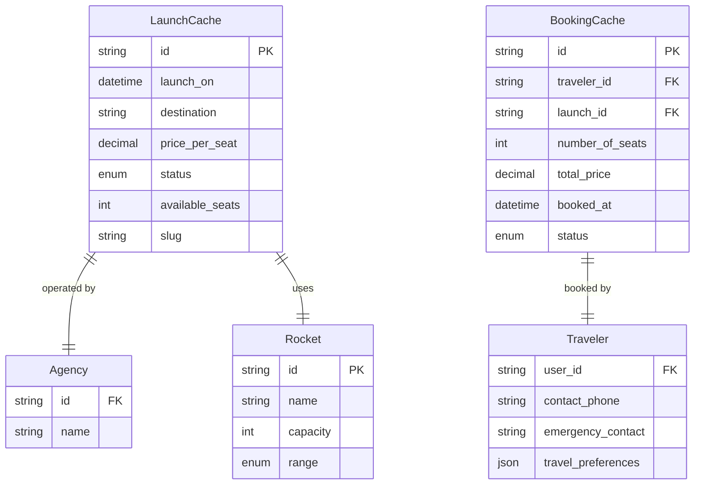

# 🚀 AstroBookings: 🧑‍💻 Cache Schema

This schema describes the documental `📇 CacheDB` of the AstroBookings platform.

## Entities



## MongoDB Collections and Schemas

Run the following commands in the MongoDB shell to create the collections and schemas.

### Launches Cache Collection

```js
db.createCollection("launches_cache", {
  validator: {
    $jsonSchema: {
      bsonType: "object",
      required: [
        "id",
        "launch_on",
        "destination",
        "price_per_seat",
        "status",
        "available_seats",
        "slug",
        "agency",
        "rocket",
      ],
      properties: {
        id: {
          bsonType: "string",
          description: "must be an string and is required",
        },
        launch_on: {
          bsonType: "date",
          description: "must be a date and is required",
        },
        destination: {
          bsonType: "string",
          description: "must be a string and is required",
        },
        price_per_seat: {
          bsonType: "decimal",
          description: "must be a decimal and is required",
        },
        status: {
          enum: ["scheduled", "completed", "cancelled"],
          description: "can only be one of the enum values and is required",
        },
        available_seats: {
          bsonType: "int",
          description: "must be an integer and is required",
        },
        slug: {
          bsonType: "string",
          description: "must be a string and is required",
        },
        agency: {
          bsonType: "object",
          required: ["id", "name"],
          properties: {
            id: {
              bsonType: "int",
              description: "must be an integer and is required",
            },
            name: {
              bsonType: "string",
              description: "must be a string and is required",
            },
          },
        },
        rocket: {
          bsonType: "object",
          required: ["id", "name", "capacity", "range"],
          properties: {
            id: {
              bsonType: "string",
              description: "must be an string and is required",
            },
            name: {
              bsonType: "string",
              description: "must be a string and is required",
            },
            capacity: {
              bsonType: "int",
              description: "must be an integer and is required",
            },
            range: {
              enum: ["short", "medium", "long"],
              description: "can only be one of the enum values and is required",
            },
          },
        },
      },
    },
  },
});
db.launches_cache.createIndex({ id: 1 }, { unique: true });
db.launches_cache.createIndex({ slug: 1 }, { unique: true });
db.launches_cache.createIndex({ status: 1 });
```

### Bookings Cache Collection

```js
db.createCollection("bookings_cache", {
  validator: {
    $jsonSchema: {
      bsonType: "object",
      required: [
        "id",
        "traveler_id",
        "launch_id",
        "number_of_seats",
        "total_price",
        "status",
        "traveler",
      ],
      properties: {
        id: {
          bsonType: "string",
          description: "must be an string and is required",
        },
        traveler_id: {
          bsonType: "string",
          description: "must be an string and is required",
        },
        launch_id: {
          bsonType: "string",
          description: "must be an string and is required",
        },
        number_of_seats: {
          bsonType: "string",
          description: "must be an string and is required",
        },
        total_price: {
          bsonType: "decimal",
          description: "must be a decimal and is required",
        },
        status: {
          enum: ["booked", "cancelled"],
          description: "can only be one of the enum values and is required",
        },
        traveler: {
          bsonType: "object",
          required: [
            "user_id",
            "contact_phone",
            "emergency_contact",
            "travel_preferences",
          ],
          properties: {
            user_id: {
              bsonType: "string",
              description: "must be an string and is required",
            },
            contact_phone: {
              bsonType: "string",
              description: "must be a string and is required",
            },
            emergency_contact: {
              bsonType: "string",
              description: "must be a string and is required",
            },
            travel_preferences: {
              bsonType: "object",
              description: "must be an object and is required",
            },
          },
        },
      },
    },
  },
});
db.bookings_cache.createIndex(
  { traveler_id: 1, launch_id: 1 },
  { unique: true }
);
```

---

## [🚀 AstroBookings](https://github.com/AstroBookings)
