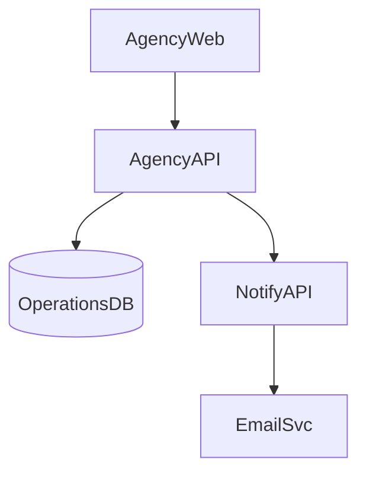
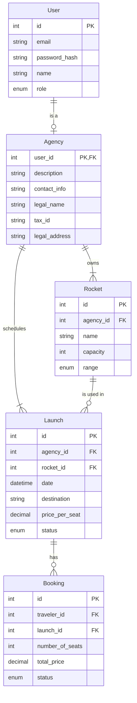

# 1. Agency Management Domain

Handles the creation and management of agency profiles, their rockets, and launch operations. Provides tools for agencies to schedule and manage their space launches.

## User Stories

### 1.0 As an agency I want to create and manage my profile so that I can offer my services
- Collect agency details including name, description, and contact information
- Allow agencies to update their profile information
- Implement validation for required fields

### 1.1 As an agency I want to add and manage my rockets so that I can use them for launches
- Allow agencies to add new rockets with details such as name, capacity, and range
- Provide functionality to edit and delete rocket information
- Implement validation for rocket specifications

### 1.2 As an agency I want to schedule new launches so that travelers can book seats
- Create a form for agencies to input launch details including date, destination, and associated rocket
- Implement date validation to ensure launches are scheduled in the future
- Associate the launch with the correct agency and rocket

### 1.3 As an agency I want to view the occupancy of my scheduled launches so that I can decide if they are viable
- Display a list of scheduled launches with their current occupancy rates
- Show the minimum occupancy required for a launch to be viable
- Provide sorting and filtering options for easy review

### 1.4 As an agency I want to delay, abort, fail or mark as successful my scheduled launches
- Implement status change functionality for launches
- Ensure proper validation before allowing status changes (e.g., can't mark as successful before launch date)
- Trigger appropriate notifications when launch status changes

### 1.5 As an agency I want to view a report of bookings for successful launches so that I can issue invoices
- Generate a detailed report of bookings for each successful launch
- Include information such as traveler details, number of seats booked, and total revenue
- Provide export functionality for the report

## Components

* `AgencyWeb`: Management interface for space agencies to oversee their operations
* `AgencyAPI`: Manages all agency-related operations including profile management, rocket fleet administration, and launch scheduling
* `OperationsDB`: Primary relational database that stores all core operational data including agency profiles, rockets, and launches
* `NotifyAPI`: Manages the notification system for various events such as launch status changes

## Component Diagram

## Entities

* `Agency`: Represents space agencies that offer launches
* `Rocket`: Represents spacecraft owned by agencies
* `Launch`: Represents a scheduled space trip
* `Booking`: Represents the reservation of seats on a specific launch
* `User`: Base entity for all system users, including agencies

## Entity Relationship Diagram

