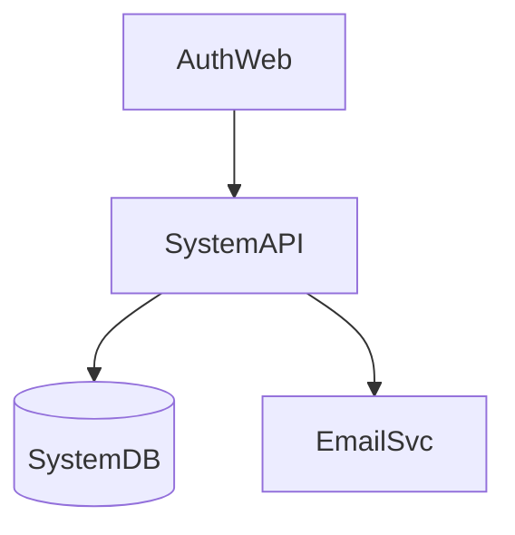
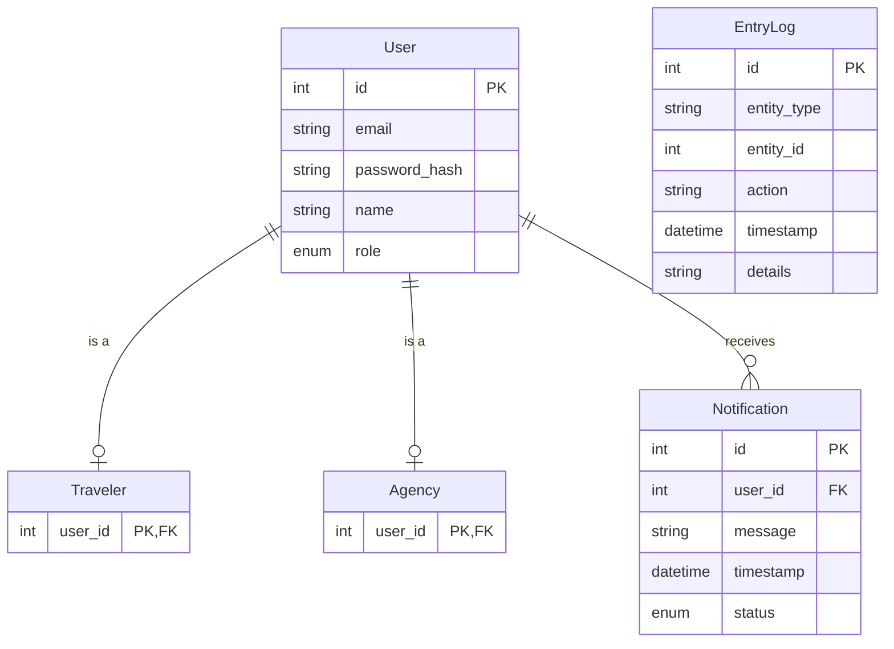

# 0. Authentication Domain

Supports user registration, login, and secure access control for all system users including agencies, travelers, and employees. Implements JWT (JSON Web Token) for maintaining secure sessions.

## User Stories

### 0.0 As a visitor I want to register an account so that I can access the system
- Collect user information including email, password, name, and role (agency, traveler, or employee)
- Validate email uniqueness
- Encrypt password before storage
- Generate a confirmation email

### 0.1 As a user I want to log in to the system so that I can access my account
- Validate user credentials against stored information
- Handle failed login attempts with appropriate error messages
- Implement rate limiting to prevent brute force attacks

### 0.2 As a user I want to log out of the system so that I can ensure the security of my account
- Invalidate the current session
- Clear any client-side stored session data
- Redirect to the login page after logout

### 0.3 As the system I need to generate a JWT for a validated user so that I can maintain their session securely
- Generate a JWT upon successful login
- Include user identifier and role in the JWT payload
- Set an appropriate expiration time for the JWT

### 0.4 As the system I need to validate a JWT and identify the user so that I can ensure secure access to protected resources
- Implement middleware to check JWT validity for protected routes
- Decode the JWT to extract user information
- Handle expired or invalid JWTs appropriately

## Components

* `AuthWeb`: Centralized authentication and user management interface for all user types
* `SystemAPI`: Central API for authentication, authorization, and system-wide operations
* `SystemDB`: Central database for system-wide data including user profiles and authentication information
* `EmailSvc`: External service for sending email notifications

## Component Diagram

## Entities

* `User`: Base entity for all system users, contains credentials and basic info
* `Traveler`: Specialization of User, represents clients who make bookings
* `Agency`: Specialization of User, represents space agencies offering launches
* `Notification`: Represents messages sent to system users about various events
* `EntryLog`: Represents system activity logs, used for monitoring and auditing

## Entity Relationship Diagram

