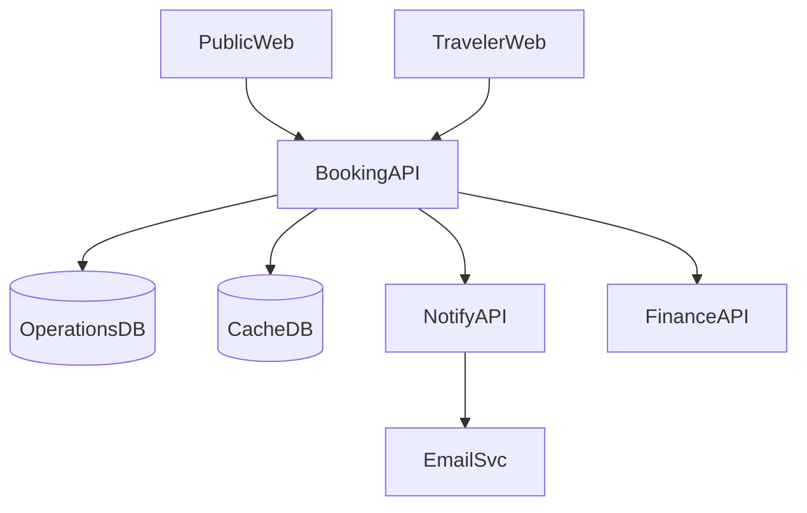
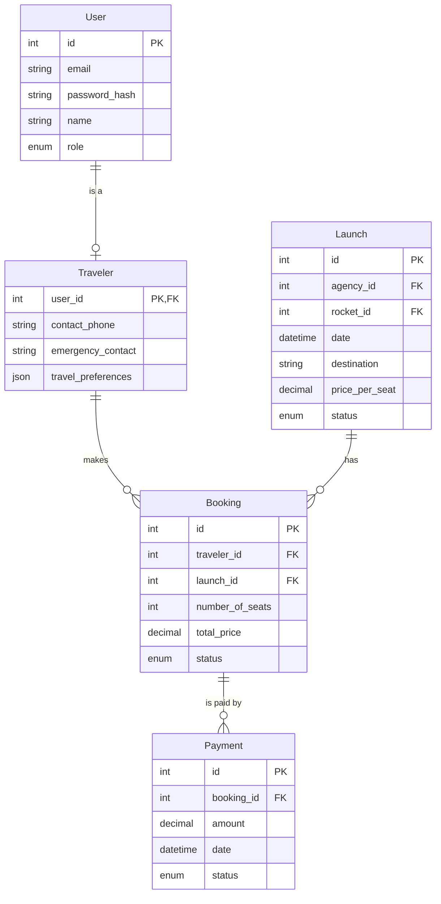

# 2. Booking Management Domain

Manages the process of viewing available launches, booking seats, and handling cancellations for travelers. Also includes the public-facing website for showcasing upcoming launches.

## User Stories

### 2.0 As a visitor I want to view available launches so that I can choose a space trip
- Display a list of upcoming launches with basic information (date, destination, available seats)
- Implement filtering and sorting options for launches
- Show pricing information for each launch

### 2.1 As a visitor I want to register as a traveler with my contact and tax information so that I can book trips and receive proper invoicing from agencies
- Create a registration form for travelers
- Collect necessary contact and tax information
- Implement validation for required fields and data formats (e.g., email, tax ID)
- Store the information securely in the database

### 2.2 As a registered traveler I want to book seats on a launch so that I can travel to space
- Allow selection of number of seats (up to 4 for regular travelers, up to 6 for VIP travelers)
- Implement a booking process with seat selection and payment
- Update launch occupancy upon successful booking
- Generate a booking confirmation

### 2.3 As a traveler I want to view updates on the status of my booked launch so that I can stay informed about my trip
- Provide a dashboard for travelers to view their booked launches
- Display current status of each booked launch
- Implement a system to show status change history

### 2.4 As a traveler I want to cancel my booking and receive a refund if eligible
- Implement a cancellation process for bookings
- Calculate refund amount based on cancellation policy and time until launch
- Update launch occupancy upon cancellation
- Trigger refund process if eligible

## Components

* `PublicWeb`: Public-facing website showcasing available space launches and company information
* `TravelerWeb`: Feature-rich interface for registered travelers to explore, book, and manage their space travel experiences
* `BookingAPI`: Handles all aspects of the booking process, including seat reservations, cancellations, and modifications
* `OperationsDB`: Primary relational database that stores all core operational data including bookings and launches
* `CacheDB`: High-performance, in-memory database used to store frequently accessed data for quick retrieval
* `NotifyAPI`: Manages the notification system for various events such as booking confirmations and launch updates
* `FinanceAPI`: Manages financial aspects including refunds for cancellations

## Component Diagram

## Entities

* `User`: Base entity for all system users, including travelers
* `Traveler`: Specialization of User, represents clients who make bookings
* `Launch`: Represents a scheduled space trip
* `Booking`: Represents the reservation of seats on a specific launch
* `Payment`: Represents payments made by travelers for bookings

## Entity Relationship Diagram

