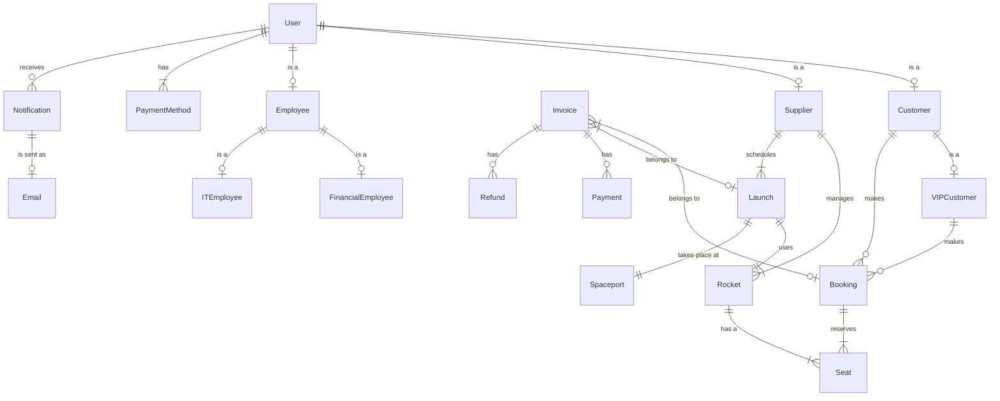

# AstroBookings Domain Model

## Entities

### User Management

- `User`: Base entity for all users of the system
- `Customer`: Person who books space travel
- `VIPCustomer`: Customer with special privileges
- `Supplier`: Company that provides rocket launches
- `Employee`: AstroBookings staff member
- `FinancialEmployee`: Employee responsible for financial operations
- `ITEmployee`: Employee responsible for IT operations

### Space Travel

- `Rocket`: Vehicle used for space travel
- `Launch`: Scheduled rocket flight to space
- `Spaceport`: Location from which rockets are launched
- `Seat`: Available space on a rocket for a passenger
- `Booking`: Reservation of seats for a launch

### Financial

- `Invoice`: Document recording a financial transaction
- `Payment`: Record of money transferred
- `Refund`: Record of money returned
- `PaymentMethod`: Way to pay for bookings

### Communication

- `Notification`: Message sent to users
- `Email`: Electronic message sent to users

## Relationships

1. `User` _is a_ `Customer`: (1)
2. `User` _is a_ `Supplier`: (1)
3. `User` _is a_ `Employee`: (1)
4. `Customer` _is a_ `VIPCustomer`: (0..1)
5. `Employee` _is a_ `FinancialEmployee`: (0..1)
6. `Employee` _is a_ `ITEmployee`: (0..1)
7. `Supplier` _manages_ `Rocket`: (1..M)
8. `Supplier` _schedules_ `Launch`: (1..M)
9. `Rocket` _has a_ `Seat`: (M)
10. `Launch` _uses_ `Rocket`: (1)
11. `Launch` _takes place at_ `Spaceport`: (1)
12. `Customer` _makes_ `Booking`: (0..M)
13. `Booking` _reserves_ `Seat`: (1..4)
14. `VIPCustomer` _makes_ `Booking`: (0..M)
15. `Booking` _reserves_ `Seat`: (1..6)
16. `Invoice` _belongs to_ `Booking`: (0..1)
17. `Invoice` _belongs to_ `Launch`: (0..1)
18. `Invoice` _has_ `Payment`: (0..M)
19. `Invoice` _has_ `Refund`: (0..M)
20. `User` _has_ `PaymentMethod`: (1..M)
21. `User` _receives_ `Notification`: (0..M)
22. `Notification` _is sent as_ `Email`: (0..1)

## Attribute details

### `User`

- **id**: Unique identifier `UUID`
- **email**: User's email address `Text`
- **password**: Encrypted password `Text`
- **name**: User's full name `Text`
- **phoneNumber**: User's contact number `Text`
- **role**: User's role in the system [Customer, VIPCustomer, Supplier, FinancialEmployee, ITEmployee] `Text`

### `Customer`

- **age**: Customer's age (18..65) `Integer`
- bookingsCount: Number of bookings made `Integer`

### `VIPCustomer`

- vipStatus: Indicates if the customer is VIP [true, false] `Boolean`

### `Supplier`

- companyName: Name of the supplier company `Text`
- feePercentage: Current fee percentage for the supplier (0.8..1.0) `Float`

### `Rocket`

- **id**: Unique identifier `UUID`
- **name**: Name of the rocket `Text`
- **capacity**: Maximum number of passengers `Integer`
- **destinationRange**: Maximum travel distance [LowEarthOrbit, ISS, Moon, Mars] `Text`

### `Launch`

- **id**: Unique identifier `UUID`
- **date**: Scheduled date of the launch `Date`
- **pricePerSeat**: Cost per seat `Decimal`
- status: Current status of the launch [Scheduled, Delayed, Aborted, Completed] `Text`
- availableSeats: Number of seats still available `Integer`

### `Spaceport`

- **id**: Unique identifier `UUID`
- **name**: Name of the spaceport `Text`
- location: Geographic location of the spaceport `Text`

### `Booking`

- **id**: Unique identifier `UUID`
- **numberOfSeats**: Number of seats booked (1..6) `Integer`
- status: Current status of the booking [Confirmed, Cancelled] `Text`
- bookingDate: Date when the booking was made `Date`

### `Invoice`

- **id**: Unique identifier `UUID`
- **number**: Unique invoice number `Text`
- **legalDate**: Date of invoice issuance `Date`
- **amount**: Total amount of the invoice `Decimal`
- type: Type of invoice [Customer, Supplier] `Text`
- status: Current status of the invoice [Paid, Unpaid, Refunded] `Text`

### `Payment`

- **id**: Unique identifier `UUID`
- **amount**: Amount paid `Decimal`
- **date**: Date of payment `Date`

### `Refund`

- **id**: Unique identifier `UUID`
- **amount**: Amount refunded `Decimal`
- **date**: Date of refund `Date`
- reason: Reason for the refund `Text`

### `PaymentMethod`

- **id**: Unique identifier `UUID`
- **type**: Type of payment method [CreditCard, BankAccount] `Text`
- **number**: Payment method number `Text`

### `Notification`

- **id**: Unique identifier `UUID`
- **message**: Content of the notification `Text`
- **date**: Date the notification was created `Date`
- status: Current status of the notification [Pending, Sent, Failed] `Text`

## Mermaid diagram code

