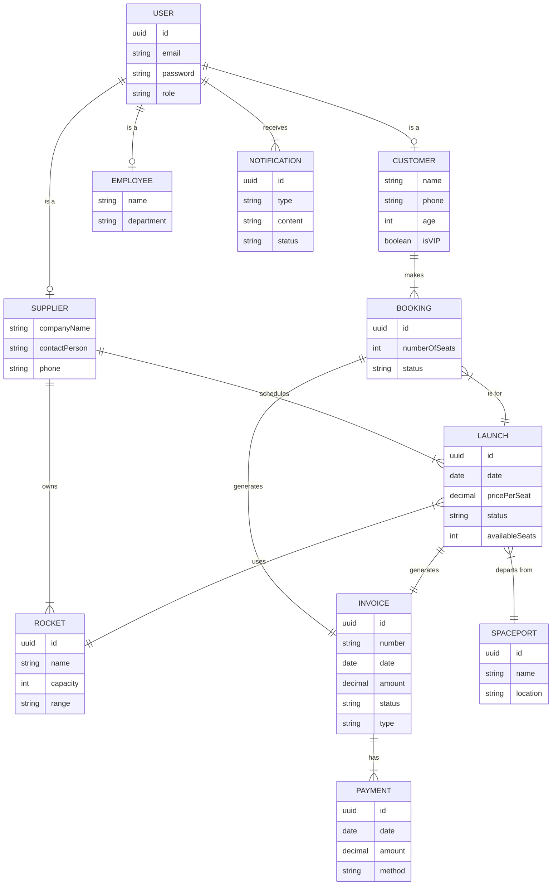

# Domain Model

## 1. Entities and their relationships

### Entities

- `User`: Represents any user of the system (Customer, Supplier, Employee)
- `Customer`: Represents a customer who can book launches
- `Supplier`: Represents a company that offers space launches
- `Employee`: Represents a financial or IT employee of AstroBookings
- `Rocket`: Represents a spacecraft used for launches
- `Launch`: Represents a scheduled space launch
- `Booking`: Represents a customer's reservation for a launch
- `Invoice`: Represents a financial document for a booking or launch
- `Payment`: Represents a financial transaction related to an invoice
- `Notification`: Represents a message sent to users
- `Spaceport`: Represents a location from which launches occur

### Relationships

- `User` _is a_ `Customer`: (1:1)
- `User` _is a_ `Supplier`: (1:1)
- `User` _is a_ `Employee`: (1:1)
- `Supplier` _owns_ `Rocket`: (1:N)
- `Supplier` _schedules_ `Launch`: (1:N)
- `Launch` _uses_ `Rocket`: (N:1)
- `Launch` _departs from_ `Spaceport`: (N:1)
- `Customer` _makes_ `Booking`: (1:N)
- `Booking` _is for_ `Launch`: (N:1)
- `Booking` _generates_ `Invoice`: (1:1)
- `Launch` _generates_ `Invoice`: (1:1)
- `Invoice` _has_ `Payment`: (1:N)
- `User` _receives_ `Notification`: (1:N)

## 2. Attributes with their types, restrictions, and relationships

### Attributes

- `User`:
  - `*id`: UUID
  - `*email`: String
  - `*password`: String (hashed)
  - `*role`: String [Customer, Supplier, FinancialEmployee, ITEmployee]

- `Customer`:
  - `*name`: String
  - `*phone`: String
  - `*age`: Integer (18-65)
  - `isVIP`: Boolean

- `Supplier`:
  - `*companyName`: String
  - `*contactPerson`: String
  - `*phone`: String

- `Employee`:
  - `*name`: String
  - `*department`: String [Financial, IT]

- `Rocket`:
  - `*id`: UUID
  - `*name`: String
  - `*capacity`: Integer
  - `*range`: String [Low Earth Orbit, ISS, Moon, Mars]

- `Launch`:
  - `*id`: UUID
  - `*date`: Date
  - `*pricePerSeat`: Decimal
  - `*status`: String [Scheduled, Delayed, Aborted, Completed]
  - `*availableSeats`: Integer

- `Booking`:
  - `*id`: UUID
  - `*numberOfSeats`: Integer (1-6)
  - `*status`: String [Confirmed, Cancelled]

- `Invoice`:
  - `*id`: UUID
  - `*number`: String
  - `*date`: Date
  - `*amount`: Decimal
  - `*status`: String [Pending, Paid, Refunded]
  - `*type`: String [Customer, Supplier]

- `Payment`:
  - `*id`: UUID
  - `*date`: Date
  - `*amount`: Decimal
  - `*method`: String [CreditCard, BankAccount]

- `Notification`:
  - `*id`: UUID
  - `*type`: String [Email, SMS]
  - `*content`: String
  - `*status`: String [Pending, Sent, Failed]

- `Spaceport`:
  - `*id`: UUID
  - `*name`: String
  - `*location`: String

## 3. Mermaid diagram code

