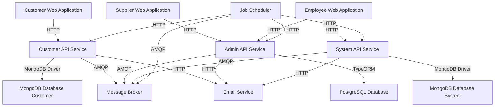

# System Architecture

## 1. Components (applications and services) and their relationships

- `Customer Web Application`: Angular-based frontend for customers to browse launches and make bookings
- `Supplier Web Application`: Angular-based frontend for suppliers to manage rockets and launches
- `Employee Web Application`: Angular-based frontend for financial and IT employees to manage the system
- `Customer API Service`: Nest.js-based API for customer-related operations, connected to MongoDB
- `Admin API Service`: Nest.js-based API for supplier and employee operations, connected to PostgreSQL
- `System API Service`: Nest.js-based API for core system operations, connected to MongoDB
- `Job Scheduler`: Node.js-based service for handling background tasks and data synchronization
- `PostgreSQL Database`: Relational database for storing supplier and employee data
- `MongoDB Database (Customer)`: NoSQL database for storing customer and booking data
- `MongoDB Database (System)`: NoSQL database for storing system-related data
- `Message Broker`: For handling asynchronous communication between services
- `Email Service`: External service for sending email notifications

## 2. Interfaces and their relationships

This architecture follows a microservices approach, separating concerns and allowing for scalability and independent deployment of components. The use of different databases (PostgreSQL and MongoDB) allows for optimized data storage and retrieval based on the needs of each component.

The Job Scheduler ensures that background tasks, such as sending notifications and synchronizing data between databases, are handled efficiently. The Message Broker facilitates asynchronous communication between services, improving system responsiveness and reliability.

Security is maintained through user authentication and role-based access control, with separate APIs for customer, admin, and system operations. The use of HTTPS for all external communications ensures data privacy and integrity.

Scalability is achieved through the separation of customer operations from supplier and employee operations, allowing each component to scale independently based on demand. The use of stateless services and a message broker further enhances the system's ability to handle increased load.

Reliability is ensured through proper logging, monitoring, and the ability to quickly start up and shut down services. The use of containerization (not explicitly mentioned but implied by the modern architecture) would further enhance reliability and ease of deployment.
