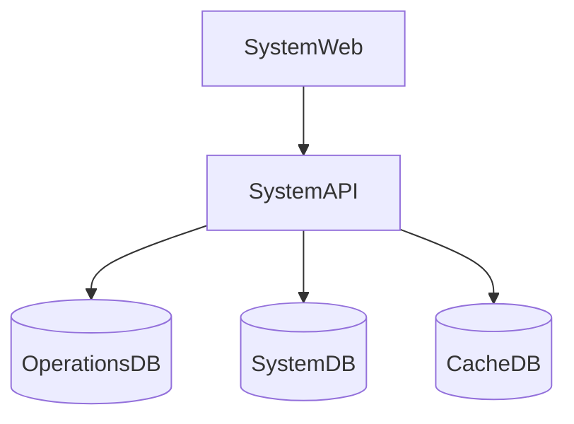
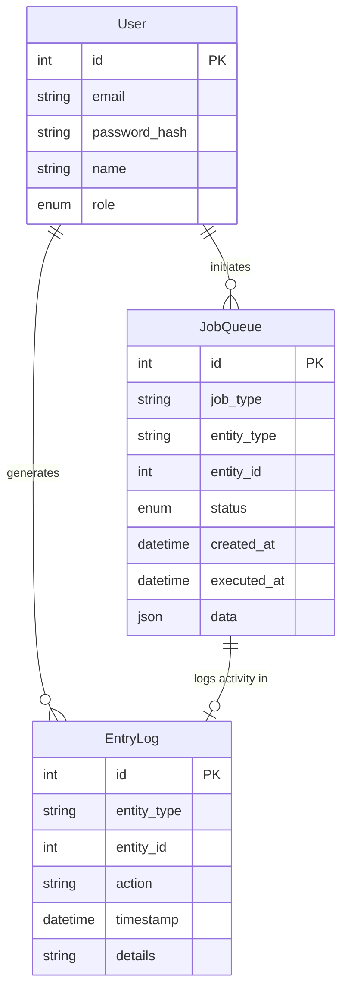

# 5. Data Synchronization Domain

Manages the synchronization of data between different databases in the system to ensure consistency across all platforms. This domain is crucial for maintaining data integrity and enabling efficient operations across the AstroBookings platform.

## User Stories

### 5.0 As a system I want to record the origin of each data change so that I can ensure accurate synchronization
- Implement a system to track the source of each data change (e.g., which service or user action initiated the change)
- Store this information along with the change details in the synchronization queue

### 5.1 As an IT employee I want to initiate synchronization processes between databases so that I can maintain data consistency
- Create an interface for IT employees to initiate manual synchronization processes
- Implement safeguards to prevent conflicts during synchronization
- Provide options to synchronize specific data sets or all data

### 5.2 As an IT employee I want to monitor the status of data synchronization processes so that I can ensure they complete successfully
- Develop a dashboard to display ongoing and completed synchronization processes
- Show information such as start time, completion percentage, and any errors encountered
- Implement alerts for failed synchronization attempts

## Components

* `SystemWeb`: Administrative interface for IT employees to manage and monitor data synchronization
* `SystemAPI`: Provides interfaces for system-wide operations, including data synchronization
* `OperationsDB`: Primary relational database that stores all core operational data
* `SystemDB`: Stores system-wide data including synchronization logs
* `CacheDB`: High-performance, in-memory database used to store frequently accessed data

## Component Diagram

## Entities

* `User`: Base entity for IT employees who manage synchronization processes
* `JobQueue`: Represents pending tasks for data synchronization between different parts of the system
* `EntryLog`: Represents system activity logs, used for tracking synchronization processes

## Entity Relationship Diagram

## Additional Technical Details

1. Synchronization Strategy:
   - Use a combination of real-time and batch synchronization depending on the criticality of the data
   - Implement conflict resolution mechanisms for handling simultaneous updates

2. Data Consistency:
   - Use transactional updates where possible to ensure data integrity
   - Implement retry mechanisms for failed synchronization attempts

3. Performance Considerations:
   - Use incremental synchronization to minimize data transfer and processing time
   - Implement data compression for large synchronization jobs

4. Security:
   - Ensure all data transfers between databases are encrypted
   - Implement access controls to restrict synchronization capabilities to authorized personnel only

5. Monitoring and Alerting:
   - Set up automated monitoring for synchronization processes
   - Implement alerting system for critical synchronization failures

6. Audit Trail:
   - Maintain detailed logs of all synchronization activities for auditing purposes
   - Include information such as initiator, timestamp, affected data, and result of synchronization
