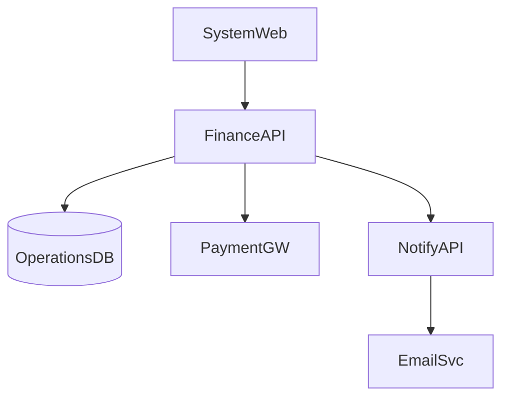
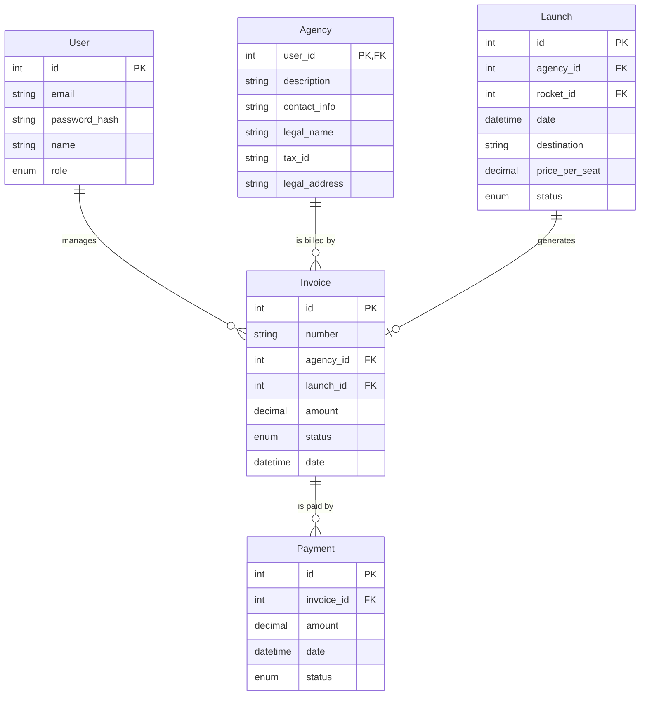

# 3. Financial Operations Domain

Handles all financial aspects of the AstroBookings platform including invoicing, payment tracking, and financial reporting. This domain is crucial for managing the monetary transactions between agencies, travelers, and the platform.

## User Stories

### 3.0 As an employee I want to generate invoices for agencies based on successful launches, applying different fee rates based on agency reliability
- Implement an invoice generation system for successful launches
- Apply fee rates based on agency reliability (1% for new agencies, 0.8% for reliable agencies)
- Include all necessary information on the invoice (launch details, number of passengers, total revenue, fee amount)

### 3.1 As an employee I want to generate invoices for agencies for aborted launches to cover platform usage costs
- Create a system to generate fixed-fee invoices (1000 USD) for aborted launches
- Include relevant details such as the aborted launch information and reason for abort if available

### 3.2 As an employee I want to track payment status of invoices
- Implement a system to record and update payment status of invoices
- Provide options to mark invoices as paid, partially paid, or overdue
- Set up automated reminders for overdue invoices

### 3.3 As an employee I want to view a revenue report for each agency to analyze their financial performance
- Generate detailed revenue reports for each agency
- Include information such as number of launches, total revenue, fees paid, and reliability status
- Provide options to view reports for different time periods (monthly, quarterly, annually)

### 3.4 As an employee I want to generate an annual report of actual and pending revenues to assess the overall financial health of the platform
- Create a comprehensive annual financial report
- Include actual revenue received, pending payments, and projections based on scheduled launches
- Provide a breakdown of revenue by agency and by month
- Generate visual representations (graphs, charts) of the financial data

## Components

* `SystemWeb`: Administrative interface for AstroBookings employees to manage financial operations
* `FinanceAPI`: Manages all financial aspects of the AstroBookings platform, including invoice generation, payment processing, and financial reporting
* `OperationsDB`: Primary relational database that stores all core operational data including financial transactions
* `PaymentGW`: External payment gateway for processing payments
* `NotifyAPI`: Manages the notification system for financial-related events such as invoice generation and payment reminders

## Component Diagram

## Entities

* `Invoice`: Represents charges generated for agencies for completed or aborted launches
* `Payment`: Represents payments made by agencies to settle issued invoices
* `Agency`: Represents space agencies that are billed for launches
* `Launch`: Represents a scheduled space trip that generates revenue
* `User`: Base entity for employees who manage financial operations

## Entity Relationship Diagram

