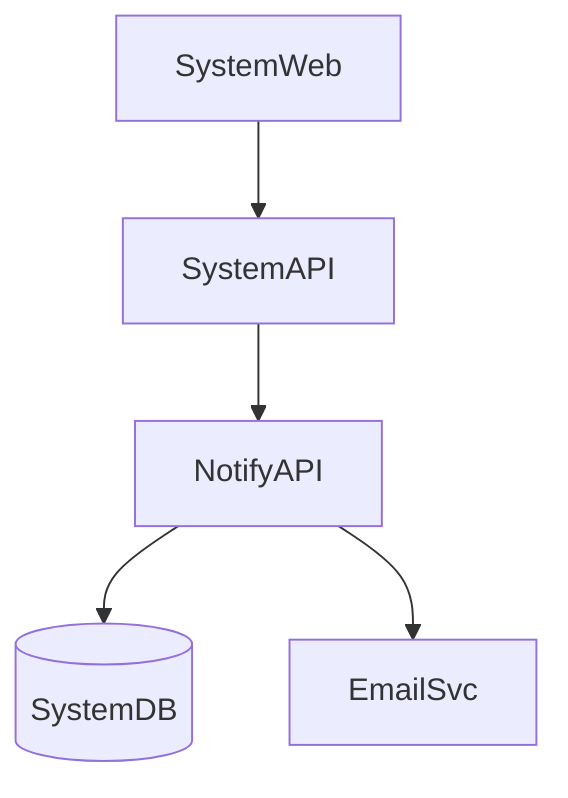
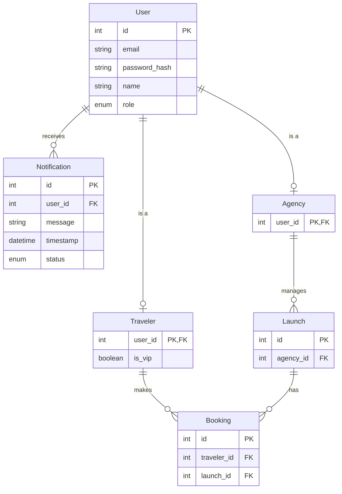

# 4. Notification System Domain

Manages all communications with users about bookings, launches, and other important events. This system ensures that all stakeholders are kept informed about relevant updates and changes in the AstroBookings platform.

## User Stories

### 4.0 As an agency I want to receive email notifications about my launches so that I can stay informed about their status, bookings, and cancellations
- Implement an email notification system for agencies
- Send notifications for new bookings, cancellations, and status changes of launches
- Include relevant details in each notification (e.g., launch date, number of seats booked/cancelled)

### 4.1 As a traveler I want to receive email notifications about my bookings so that I can stay informed about cancellations, delays, or aborts of my booked launches
- Set up an email notification system for travelers
- Send confirmation emails for new bookings and cancellations
- Notify travelers of any changes to their booked launches (delays, aborts, etc.)

### 4.2 As a VIP traveler I want to receive exclusive notifications about new launches so that I can book early
- Implement a system to identify VIP travelers (those who have booked at least two trips)
- Create a separate notification queue for VIP travelers
- Send early notifications about new launches to VIP travelers

### 4.3 As an IT employee I want to view the status of the notification queue so that I can ensure proper system operation
- Create a dashboard for monitoring the notification queue
- Display information such as number of pending notifications, successful sends, and failed attempts
- Implement filtering and sorting options for the queue

### 4.4 As an IT employee I want to change the status of notifications so that I can manage the notification system effectively
- Implement functionality to manually update the status of notifications
- Provide options to mark notifications as sent or delete them from the queue
- Implement proper access controls to ensure only authorized employees can make these changes

## Components

* `NotifyAPI`: Manages the notification system for the entire platform, handling email notifications for various events
* `SystemWeb`: Administrative interface for IT employees to manage and monitor the notification system
* `SystemDB`: Stores notification queues and user communication preferences
* `EmailSvc`: External service for sending out email notifications
* `SystemAPI`: Provides notification status and management capabilities

## Component Diagram

## Entities

* `User`: Base entity for all system users who can receive notifications
* `Notification`: Represents messages sent to system users about various events
* `Agency`: Specialization of User, represents agencies receiving notifications about their launches
* `Traveler`: Specialization of User, represents travelers receiving notifications about their bookings
* `Launch`: Represents a scheduled space trip that can trigger notifications
* `Booking`: Represents a reservation that can trigger notifications

## Entity Relationship Diagram

